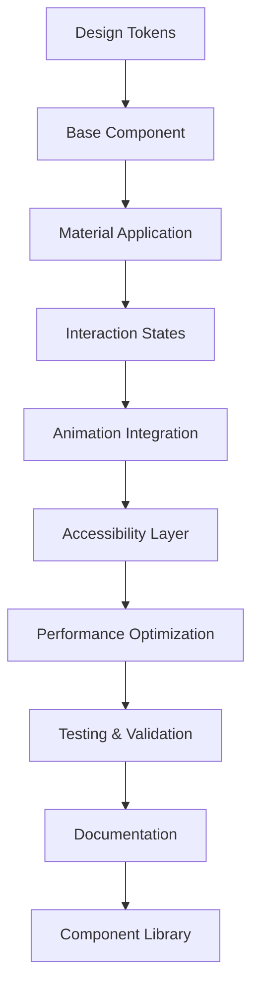

# Apple Liquid Glass Component Library Specification

## 1. Product Overview

This document provides comprehensive specifications for all UI components in the ScreenScape 2.0 Apple Liquid Glass component library. Each component is designed to strictly adhere to Apple's Human Interface Guidelines while implementing authentic Liquid Glass material properties, ensuring a cohesive and premium user experience across all application interfaces.

The component library serves as the foundation for the complete visual transformation of ScreenScape 2.0, providing developers with pixel-perfect, accessible, and performant components that match Apple's design standards exactly.

## 2. Core Features

### 2.1 Component Categories

**Navigation Components:**
- **Header Bar:** Translucent navigation with dynamic tinting
- **Tab Bar:** Bottom navigation with SF Symbols
- **Sidebar:** Collapsible navigation with glass panels
- **Breadcrumb:** Hierarchical navigation with glass separators

**Content Components:**
- **Glass Cards:** Multi-variant content containers
- **Glass Panels:** Layered information displays
- **Media Containers:** Content-preserving media displays
- **List Items:** Glass-enhanced list elements

**Interactive Components:**
- **Glass Buttons:** Primary interaction elements
- **Form Controls:** Input fields, toggles, sliders
- **Action Sheets:** Modal selection interfaces
- **Context Menus:** Contextual action overlays

**Feedback Components:**
- **Loading States:** Progress indicators and spinners
- **Notifications:** Alert and status messages
- **Tooltips:** Contextual help overlays
- **Status Indicators:** System state displays

### 2.2 Material Specifications

**Glass Material Variants:**
- **Ultra Thin:** 0.02 opacity, 20px blur, subtle presence
- **Thin:** 0.05 opacity, 25px blur, light interaction
- **Regular:** 0.08 opacity, 30px blur, standard visibility
- **Thick:** 0.12 opacity, 35px blur, prominent display
- **Prominent:** 0.15 opacity, 40px blur, maximum visibility

**Depth Layer System:**
- **Layer 0:** Base content (no elevation)
- **Layer 1:** Cards and panels (2px shadow)
- **Layer 2:** Floating elements (8px shadow)
- **Layer 3:** Modals and overlays (16px shadow)
- **Layer 4:** Tooltips and popovers (24px shadow)

### 2.3 Component Details

| Component Name | Material Treatment | Interaction States | Accessibility Features |
|----------------|-------------------|-------------------|------------------------|
| **Header Bar** | Thin material with dynamic tinting, 44px height | Hover: brightness +10%, Active: scale 0.98 | VoiceOver navigation, keyboard shortcuts |
| **Glass Button** | Regular material with surface tension | Hover: depth +2px, Active: scale 0.95 | 44px touch target, focus indicators |
| **Glass Card** | Thin to regular material based on content | Hover: elevation +4px, Select: border highlight | Semantic structure, keyboard navigation |
| **Form Input** | Ultra thin material with focus enhancement | Focus: border glow, Error: red tint | Dynamic type, clear error messaging |
| **Tab Bar** | Prominent material with icon emphasis | Selection: icon weight change, haptic feedback | Badge notifications, accessibility labels |
| **Modal Panel** | Thick material with backdrop blur | Entry: scale from 0.9, Exit: fade with scale | Focus trapping, escape key handling |
| **Loading Spinner** | Translucent with system color | Continuous rotation with spring easing | Reduced motion alternative, progress announcements |
| **Notification** | Regular material with urgency coloring | Slide in from top, auto-dismiss timer | Screen reader announcements, action buttons |

## 3. Core Process

### 3.1 Component Development Workflow

**Design Phase:**
1. Review Apple's Human Interface Guidelines for component specifications
2. Define material properties and interaction states
3. Create responsive behavior patterns for all device sizes
4. Establish accessibility requirements and keyboard navigation

**Implementation Phase:**
1. Build component with TypeScript and styled-components
2. Implement glass material properties with CSS backdrop-filter
3. Add fluid animations using Framer Motion with Apple timing curves
4. Integrate accessibility features with React ARIA

**Testing Phase:**
1. Verify visual accuracy against Apple's design resources
2. Test interaction states and animation performance
3. Validate accessibility compliance with screen readers
4. Performance testing across target devices and browsers

**Documentation Phase:**
1. Create usage guidelines and best practices
2. Document API specifications and prop interfaces
3. Provide code examples and implementation patterns
4. Establish testing protocols and quality standards

### 3.2 Component Integration Flow



## 4. User Interface Design

### 4.1 Design Principles

**Material Authenticity:**
- **Glass Properties:** Accurate transparency, blur, and refraction effects
- **Depth Perception:** Proper layering with realistic shadows and highlights
- **Surface Tension:** Subtle edge treatments that enhance material believability
- **Light Interaction:** Dynamic tinting based on content and environment

**Interaction Design:**
- **Fluid Motion:** Spring-based animations with Apple's timing curves
- **Haptic Feedback:** Visual feedback that simulates tactile responses
- **State Transitions:** Smooth morphing between component states
- **Micro-interactions:** Subtle details that enhance user engagement

### 4.2 Component Design Specifications

| Component | Dimensions | Material | Typography | Spacing |
|-----------|------------|----------|------------|---------|
| **Header Bar** | Full width × 44px | Thin material, dynamic tint | SF Pro Text 17pt Semibold | 16px horizontal padding |
| **Glass Button Small** | Auto × 32px | Regular material | SF Pro Text 15pt Medium | 12px horizontal, 8px vertical |
| **Glass Button Medium** | Auto × 44px | Regular material | SF Pro Text 17pt Medium | 16px horizontal, 12px vertical |
| **Glass Button Large** | Auto × 56px | Regular material | SF Pro Text 19pt Medium | 24px horizontal, 16px vertical |
| **Glass Card** | Variable × Auto | Thin to regular material | SF Pro Text 17pt Regular | 16px all sides |
| **Form Input** | Full width × 44px | Ultra thin material | SF Pro Text 17pt Regular | 16px horizontal, 12px vertical |
| **Tab Bar** | Full width × 49px | Prominent material | SF Pro Text 10pt Medium | 8px top, 16px bottom |
| **Modal Panel** | 90% width × Auto | Thick material | SF Pro Text 17pt Regular | 24px all sides |

### 4.3 Responsive Behavior

**iPhone (375px - 428px):**
- Single-column layouts with full-width components
- Touch-optimized 44px minimum target sizes
- Simplified navigation with collapsible elements
- Reduced glass complexity for performance

**iPad (768px - 1024px):**
- Two-column layouts with adaptive component sizing
- Enhanced glass effects with increased blur radius
- Sidebar navigation with persistent visibility
- Multi-touch gesture support

**Desktop (1200px+):**
- Multi-column layouts with floating glass panels
- Full glass effect implementation with hover states
- Keyboard navigation with visible focus indicators
- Cursor-based interactions with detailed feedback

## 5. Technical Implementation

### 5.1 Component Architecture

**Base Component Structure:**
```typescript
interface BaseComponentProps {
  className?: string;
  children?: React.ReactNode;
  material?: 'ultraThin' | 'thin' | 'regular' | 'thick' | 'prominent';
  depth?: 0 | 1 | 2 | 3 | 4;
  disabled?: boolean;
  'aria-label'?: string;
}

interface GlassComponentProps extends BaseComponentProps {
  tint?: string;
  bordered?: boolean;
  interactive?: boolean;
  reducedMotion?: boolean;
}
```

**Material System Implementation:**
```typescript
const glassMaterials = {
  ultraThin: {
    backgroundColor: 'rgba(255, 255, 255, 0.02)',
    backdropFilter: 'blur(20px) brightness(1.1) saturate(1.2)',
    border: '1px solid rgba(255, 255, 255, 0.1)',
  },
  thin: {
    backgroundColor: 'rgba(255, 255, 255, 0.05)',
    backdropFilter: 'blur(25px) brightness(1.15) saturate(1.25)',
    border: '1px solid rgba(255, 255, 255, 0.12)',
  },
  regular: {
    backgroundColor: 'rgba(255, 255, 255, 0.08)',
    backdropFilter: 'blur(30px) brightness(1.2) saturate(1.3)',
    border: '1px solid rgba(255, 255, 255, 0.15)',
  },
  thick: {
    backgroundColor: 'rgba(255, 255, 255, 0.12)',
    backdropFilter: 'blur(35px) brightness(1.25) saturate(1.35)',
    border: '1px solid rgba(255, 255, 255, 0.18)',
  },
  prominent: {
    backgroundColor: 'rgba(255, 255, 255, 0.15)',
    backdropFilter: 'blur(40px) brightness(1.3) saturate(1.4)',
    border: '1px solid rgba(255, 255, 255, 0.2)',
  },
};
```

### 5.2 Animation Specifications

**Apple Timing Curves:**
```typescript
const appleEasing = {
  spring: { type: 'spring', damping: 0.6, stiffness: 100 },
  easeInOut: { duration: 0.6, ease: [0.4, 0, 0.2, 1] },
  gentle: { duration: 0.8, ease: [0.25, 0.1, 0.25, 1] },
  snappy: { duration: 0.3, ease: [0.4, 0, 0.6, 1] },
};

const componentAnimations = {
  buttonPress: {
    scale: 0.95,
    transition: appleEasing.snappy,
  },
  cardHover: {
    y: -4,
    scale: 1.02,
    transition: appleEasing.gentle,
  },
  modalEntry: {
    scale: [0.9, 1],
    opacity: [0, 1],
    transition: appleEasing.spring,
  },
  loadingSpinner: {
    rotate: 360,
    transition: {
      duration: 1,
      repeat: Infinity,
      ease: 'linear',
    },
  },
};
```

### 5.3 Accessibility Implementation

**Focus Management:**
```typescript
const useFocusManagement = () => {
  const focusRingStyles = {
    outline: '2px solid #007AFF',
    outlineOffset: '2px',
    borderRadius: '4px',
  };

  const trapFocus = (element: HTMLElement) => {
    const focusableElements = element.querySelectorAll(
      'button, [href], input, select, textarea, [tabindex]:not([tabindex="-1"])'
    );
    // Focus trapping logic
  };

  return { focusRingStyles, trapFocus };
};
```

**Screen Reader Support:**
```typescript
const useAccessibilityAnnouncements = () => {
  const announce = (message: string, priority: 'polite' | 'assertive' = 'polite') => {
    const announcement = document.createElement('div');
    announcement.setAttribute('aria-live', priority);
    announcement.setAttribute('aria-atomic', 'true');
    announcement.className = 'sr-only';
    announcement.textContent = message;
    document.body.appendChild(announcement);
    setTimeout(() => document.body.removeChild(announcement), 1000);
  };

  return { announce };
};
```

## 6. Quality Assurance

### 6.1 Component Testing Standards

**Visual Regression Testing:**
- Pixel-perfect comparison with Apple's design resources
- Cross-browser rendering consistency verification
- Responsive behavior validation across all breakpoints
- Animation smoothness and timing accuracy

**Accessibility Testing:**
- Screen reader compatibility with NVDA, JAWS, and VoiceOver
- Keyboard navigation flow and focus management
- Color contrast ratio validation (WCAG AA compliance)
- Dynamic type scaling support verification

**Performance Testing:**
- Component rendering time measurement
- Animation frame rate monitoring (60fps target)
- Memory usage profiling during interactions
- Bundle size impact analysis

### 6.2 Implementation Checklist

**Design Compliance:**
- [ ] Material properties match Apple specifications exactly
- [ ] Typography uses San Francisco font family with correct weights
- [ ] Spacing follows 8px baseline grid system
- [ ] Colors use Apple's official system palette
- [ ] Icons are SF Symbols with proper weight variations

**Technical Standards:**
- [ ] TypeScript interfaces are properly defined
- [ ] Component props follow consistent naming conventions
- [ ] Accessibility attributes are correctly implemented
- [ ] Performance optimizations are applied (React.memo, etc.)
- [ ] Error boundaries handle edge cases gracefully

**Quality Metrics:**
- [ ] 100% test coverage for component logic
- [ ] Zero accessibility violations in automated testing
- [ ] Sub-16ms render times for smooth 60fps performance
- [ ] Cross-browser compatibility verified on target platforms
- [ ] Documentation includes usage examples and best practices

This comprehensive component library specification ensures that every UI element in ScreenScape 2.0 meets Apple's exacting standards for design, functionality, and accessibility while maintaining optimal performance across all target devices and platforms.