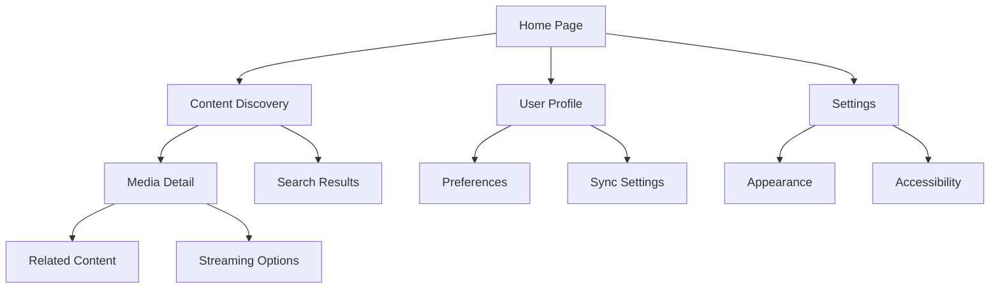
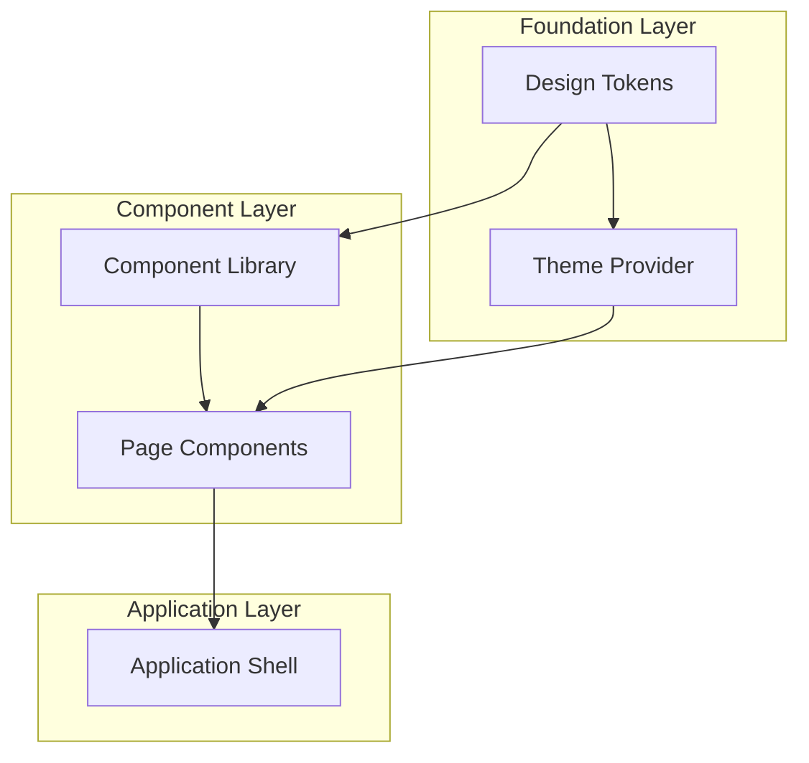

# Apple Liquid Glass Design System Specification

## 1. Product Overview

This document defines the comprehensive Apple Liquid Glass Design System for ScreenScape 2.0, establishing a complete visual and technical framework that strictly adheres to Apple's Human Interface Guidelines and Liquid Glass material specifications. The system ensures pixel-perfect implementation across all Apple devices while maintaining optimal performance and accessibility standards.

The design system transforms the entire application interface to match Apple's premium aesthetic standards, implementing authentic material properties, sophisticated depth systems, and fluid interaction patterns that create an immersive, professional user experience indistinguishable from Apple's own applications.

## 2. Core Features

### 2.1 Design Foundation Specifications

**Typography System:**
- **Primary Font:** San Francisco (SF Pro Display, SF Pro Text)
- **Weight Variations:** Light (300), Regular (400), Medium (500), Semibold (600), Bold (700)
- **Dynamic Type Scaling:** iOS-compliant size categories from xSmall to xxxLarge
- **Line Height:** 1.2-1.6 ratio based on text size and context
- **Letter Spacing:** Apple's precise tracking values (-0.4px to 0.6px)

**Color Palette System:**
- **System Colors:** Blue (#007AFF), Green (#34C759), Orange (#FF9500), Red (#FF3B30)
- **Neutral Colors:** Label, Secondary Label, Tertiary Label, Quaternary Label
- **Background Colors:** System Background, Secondary Background, Tertiary Background
- **Dynamic Adaptation:** Automatic light/dark mode switching with proper contrast ratios
- **Accessibility Colors:** High contrast variants for improved readability

**Spacing Grid System:**
- **Base Unit:** 8px baseline grid
- **Micro Spacing:** 4px, 8px, 12px for tight layouts
- **Standard Spacing:** 16px, 24px, 32px for general layouts
- **Macro Spacing:** 48px, 64px, 80px for section separation
- **Component Padding:** 12px, 16px, 20px, 24px based on hierarchy

### 2.2 Material Properties

**Liquid Glass Material Specifications:**
- **Transparency Levels:** 0.02-0.15 opacity for different depth layers
- **Blur Intensity:** 20px-40px backdrop-filter blur for authentic glass effect
- **Brightness Adjustment:** 1.1-1.3 multiplier for content visibility
- **Saturation Enhancement:** 1.2-1.4 multiplier for vibrant appearance
- **Edge Treatment:** 1px border with 0.1-0.2 opacity for definition

**Depth System Implementation:**
- **Layer 0:** Base content (no elevation)
- **Layer 1:** Cards and panels (2px shadow, 0.1 opacity)
- **Layer 2:** Floating elements (8px shadow, 0.15 opacity)
- **Layer 3:** Modals and overlays (16px shadow, 0.2 opacity)
- **Layer 4:** Tooltips and popovers (24px shadow, 0.25 opacity)

### 2.3 Component Library

| Component Category | Component Name | Material Treatment |
|-------------------|----------------|-------------------|
| **Navigation** | Header Bar | Liquid glass with dynamic tinting, 44px height |
| **Navigation** | Tab Bar | Translucent background, SF Symbols icons |
| **Navigation** | Sidebar | Layered glass panels with content-aware opacity |
| **Content** | Glass Cards | Multi-layer transparency with hover depth effects |
| **Content** | Glass Panels | Sophisticated backdrop filtering with edge highlights |
| **Content** | Media Containers | Content-preserving transparency with dynamic tinting |
| **Interactive** | Glass Buttons | Liquid material with surface tension animations |
| **Interactive** | Form Controls | Native iOS-style inputs with glass treatment |
| **Interactive** | Toggle Switches | Apple-standard dimensions with glass aesthetics |
| **Feedback** | Loading States | Fluid animations with glass material continuity |
| **Feedback** | Progress Indicators | Translucent tracks with vibrant fill colors |
| **Feedback** | Notifications | Floating glass panels with appropriate urgency styling |

## 3. Core Process

### 3.1 Design System Implementation Flow

**Phase 1: Foundation Setup**
1. Install and configure San Francisco font family across all text elements
2. Implement comprehensive color token system with light/dark mode support
3. Establish 8px baseline grid system for consistent spacing
4. Create SF Symbols icon library with proper weight and size variations

**Phase 2: Component Development**
1. Redesign all existing components to Liquid Glass specifications
2. Implement material properties with proper transparency and blur effects
3. Add sophisticated depth system with layered shadows and highlights
4. Create responsive behavior using Auto Layout principles

**Phase 3: Animation Integration**
1. Implement Core Animation timing curves (ease-in-out, spring)
2. Add fluid state transitions for all interactive elements
3. Create micro-interactions that enhance material authenticity
4. Optimize animations for 60fps performance across all devices

**Phase 4: Quality Assurance**
1. Verify pixel-perfect implementation against Apple's design resources
2. Test visual consistency across all breakpoints and orientations
3. Validate WCAG AA accessibility compliance
4. Performance testing for rendering speed and memory usage

### 3.2 Page Navigation Flow



## 4. User Interface Design

### 4.1 Design Style

**Visual Characteristics:**
- **Primary Colors:** System Blue (#007AFF), System Green (#34C759)
- **Secondary Colors:** System Orange (#FF9500), System Purple (#AF52DE)
- **Material Treatment:** Liquid glass with 0.02-0.15 opacity layers
- **Typography:** San Francisco with dynamic type scaling
- **Iconography:** SF Symbols with 1.5, 2.0, 2.5 weight variations
- **Animation Style:** Fluid, physics-based with spring timing (0.6s duration, 0.4 damping)

**Layout Principles:**
- **Grid System:** 8px baseline with 16px, 24px, 32px column gutters
- **Card Design:** Rounded corners (12px-20px radius) with glass material
- **Navigation:** Top-aligned with translucent background treatment
- **Content Hierarchy:** Clear depth separation using shadow and opacity

### 4.2 Page Design Overview

| Page Name | Component Modules | UI Elements |
|-----------|------------------|-------------|
| **Home Page** | Hero Section, Navigation, Content Grid | Liquid glass hero banner with dynamic tinting, translucent navigation bar, card-based content layout with hover depth effects |
| **Media Detail** | Header, Content Panel, Action Bar | Full-width glass header with backdrop blur, content panels with layered transparency, floating action buttons with surface tension |
| **Search Results** | Search Bar, Filter Panel, Results Grid | Prominent search input with glass treatment, collapsible filter sidebar, responsive grid with glass card containers |
| **User Profile** | Avatar Section, Preferences Panel, Sync Status | Circular avatar with glass frame, settings panels with material depth, status indicators with system colors |
| **Settings** | Navigation List, Control Panels, Toggle Groups | List-style navigation with glass separators, grouped controls with proper spacing, native-style toggles and sliders |

### 4.3 Responsiveness

**Device Adaptation Strategy:**
- **iPhone (375px-428px):** Single-column layouts with full-width glass panels, touch-optimized 44px minimum target sizes
- **iPad (768px-1024px):** Two-column layouts with sidebar navigation, adaptive glass panel sizing
- **Desktop (1200px+):** Multi-column layouts with floating glass panels, hover states with depth transitions

**Interaction Optimization:**
- **Touch Devices:** 44px minimum touch targets, haptic feedback simulation through animation
- **Desktop:** Hover states with glass material transitions, cursor feedback for interactive elements
- **Accessibility:** Dynamic type support, reduced motion preferences, high contrast mode compatibility

## 5. Technical Architecture

### 5.1 Design System Architecture



### 5.2 Technology Stack

- **Frontend:** React 18 + TypeScript + Styled Components
- **Design System:** Custom Apple Liquid Glass implementation
- **Animation:** Framer Motion with Apple timing curves
- **Responsive:** CSS Grid + Flexbox with Auto Layout principles
- **Accessibility:** React ARIA + VoiceOver compatibility
- **Performance:** GPU acceleration + 60fps optimization

### 5.3 Component Architecture

**Design Token Structure:**
```typescript
interface AppleDesignTokens {
  colors: {
    system: SystemColors;
    semantic: SemanticColors;
    glass: GlassMaterialColors;
  };
  typography: {
    families: FontFamilies;
    sizes: DynamicTypeSizes;
    weights: FontWeights;
  };
  spacing: {
    baseline: number; // 8px
    scale: SpacingScale;
  };
  materials: {
    glass: GlassMaterialProperties;
    depth: DepthLayers;
  };
}
```

## 6. Implementation Standards

### 6.1 Performance Requirements

**Rendering Benchmarks:**
- **Initial Load:** < 2 seconds on 3G networks
- **Animation Frame Rate:** Consistent 60fps across all devices
- **Memory Usage:** < 100MB baseline, < 200MB peak
- **Bundle Size:** < 500KB gzipped for core design system

**Optimization Strategies:**
- **GPU Acceleration:** Transform3d for all animations
- **Layer Promotion:** Will-change property for interactive elements
- **Efficient Rendering:** React.memo and useMemo for expensive calculations
- **Asset Optimization:** WebP images with fallbacks, optimized SVG icons

### 6.2 Accessibility Compliance

**WCAG AA Requirements:**
- **Contrast Ratios:** 4.5:1 for normal text, 3:1 for large text
- **Dynamic Type:** Support for 200% zoom without horizontal scrolling
- **Keyboard Navigation:** Full functionality without mouse/touch
- **Screen Reader:** Proper ARIA labels and semantic structure
- **Reduced Motion:** Respect prefers-reduced-motion preferences

### 6.3 Cross-Browser Compatibility

**Browser Support Matrix:**
- **Safari:** 14+ (primary target with full feature support)
- **Chrome:** 90+ (full compatibility with minor fallbacks)
- **Firefox:** 88+ (graceful degradation for advanced glass effects)
- **Edge:** 90+ (Chromium-based compatibility)

**Fallback Strategy:**
- **Backdrop-filter:** Solid color backgrounds for unsupported browsers
- **CSS Grid:** Flexbox fallbacks for older implementations
- **Custom Properties:** Static values for IE11 (if required)

## 7. Quality Assurance

### 7.1 Testing Protocols

**Visual Regression Testing:**
- **Pixel-perfect verification** against Apple's design resources
- **Cross-device consistency** testing on iPhone, iPad, Mac
- **Animation smoothness** validation at 60fps
- **Material authenticity** comparison with native iOS elements

**Performance Testing:**
- **Loading time measurements** across different network conditions
- **Memory usage profiling** during extended usage sessions
- **Animation performance** monitoring with Chrome DevTools
- **Bundle size analysis** with webpack-bundle-analyzer

### 7.2 Device Testing Matrix

| Device Category | Models | Screen Sizes | Testing Focus |
|----------------|--------|--------------|---------------|
| **iPhone** | 12 Mini, 13, 14 Pro Max | 375px-428px | Touch interactions, dynamic type |
| **iPad** | Air, Pro 11", Pro 12.9" | 768px-1024px | Adaptive layouts, multitasking |
| **Mac** | MacBook Air, iMac, Studio Display | 1280px-5120px | Hover states, keyboard navigation |

### 7.3 Documentation Standards

**Component Documentation:**
- **Usage Guidelines:** When and how to use each component
- **API Reference:** Props, methods, and customization options
- **Design Specifications:** Exact measurements, colors, and spacing
- **Accessibility Notes:** ARIA requirements and keyboard behavior
- **Performance Considerations:** Optimization tips and best practices

This comprehensive specification ensures the complete transformation of ScreenScape 2.0 into a premium Apple Liquid Glass experience that meets the highest standards of design, performance, and accessibility.