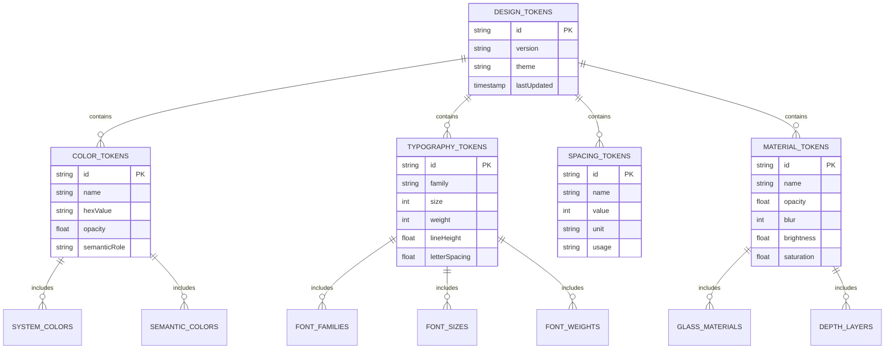

# Apple Liquid Glass Technical Implementation Guide

## 1. Architecture Design


## 2. Technology Description

- **Frontend:** React@18 + TypeScript@5 + Styled-Components@6
- **Animation:** Framer Motion@10 + React Spring@9
- **Design System:** Custom Apple Liquid Glass implementation
- **State Management:** Zustand@4 + React Context
- **Styling:** CSS-in-JS + CSS Custom Properties
- **Performance:** React.memo + useMemo + useCallback optimization
- **Accessibility:** React ARIA@3 + Focus Management
- **Testing:** Jest@29 + React Testing Library@14

## 3. Route Definitions

| Route | Purpose | Apple Design Implementation |
|-------|---------|----------------------------|
| `/` | Home page with hero section and content discovery | Liquid glass hero banner, translucent navigation, card-based layout |
| `/search` | Search interface with filters and results | Prominent glass search bar, collapsible filter sidebar, responsive grid |
| `/media/:id` | Media detail page with streaming options | Full-width glass header, layered content panels, floating action buttons |
| `/profile` | User profile and preferences management | Circular avatar with glass frame, settings panels with material depth |
| `/settings` | Application settings and configuration | List-style navigation with glass separators, native-style controls |
| `/sync` | Device synchronization and linking | Status indicators with system colors, connection flow with glass panels |
| `/demo` | Design system showcase and component library | Interactive component gallery with live examples |

## 4. API Definitions

### 4.1 Design System API

**Theme Provider Configuration**
```typescript
interface AppleThemeConfig {
  colorScheme: 'light' | 'dark' | 'auto';
  reducedMotion: boolean;
  reducedTransparency: boolean;
  dynamicType: DynamicTypeSize;
  contrastLevel: 'normal' | 'high';
}

// Theme Provider Setup
<AppleDesignSystemProvider config={themeConfig}>
  <App />
</AppleDesignSystemProvider>
```

**Component API Structure**
```typescript
// Glass Button Component
interface GlassButtonProps {
  variant: 'primary' | 'secondary' | 'accent';
  size: 'small' | 'medium' | 'large';
  material: 'glass' | 'translucent' | 'opaque';
  disabled?: boolean;
  loading?: boolean;
  children: React.ReactNode;
  onPress?: () => void;
}

// Glass Panel Component
interface GlassPanelProps {
  depth: 1 | 2 | 3 | 4;
  material: 'ultraThin' | 'thin' | 'regular' | 'thick';
  tint?: string;
  bordered?: boolean;
  children: React.ReactNode;
}

// Glass Card Component
interface GlassCardProps {
  aspectRatio?: 'square' | 'portrait' | 'landscape';
  interactive?: boolean;
  elevation: 'low' | 'medium' | 'high';
  content: React.ReactNode;
  onSelect?: () => void;
}
```

### 4.2 Animation API

**Core Animation Controller**
```typescript
interface AnimationConfig {
  duration: number;
  easing: 'easeInOut' | 'spring' | 'linear';
  delay?: number;
  repeat?: number | 'infinite';
}

// Animation Presets
const AppleAnimations = {
  spring: { type: 'spring', damping: 0.6, stiffness: 100 },
  easeInOut: { duration: 0.6, ease: [0.4, 0, 0.2, 1] },
  gentle: { duration: 0.8, ease: [0.25, 0.1, 0.25, 1] },
  snappy: { duration: 0.3, ease: [0.4, 0, 0.6, 1] }
};
```

### 4.3 Material System API

**Glass Material Properties**
```typescript
interface GlassMaterial {
  opacity: number; // 0.02-0.15
  blur: number; // 20-40px
  brightness: number; // 1.1-1.3
  saturation: number; // 1.2-1.4
  borderOpacity: number; // 0.1-0.2
  shadowIntensity: number; // 0.1-0.25
}

// Material Presets
const AppleMaterials = {
  ultraThin: { opacity: 0.02, blur: 20, brightness: 1.1, saturation: 1.2 },
  thin: { opacity: 0.05, blur: 25, brightness: 1.15, saturation: 1.25 },
  regular: { opacity: 0.08, blur: 30, brightness: 1.2, saturation: 1.3 },
  thick: { opacity: 0.12, blur: 35, brightness: 1.25, saturation: 1.35 },
  prominent: { opacity: 0.15, blur: 40, brightness: 1.3, saturation: 1.4 }
};
```

## 5. Server Architecture Diagram


## 6. Data Model

### 6.1 Design Token Data Model



### 6.2 Component State Data Model


### 6.3 Data Definition Language

**Design Token Storage**
```sql
-- Design Tokens Table
CREATE TABLE design_tokens (
    id UUID PRIMARY KEY DEFAULT gen_random_uuid(),
    token_type VARCHAR(50) NOT NULL CHECK (token_type IN ('color', 'typography', 'spacing', 'material')),
    name VARCHAR(100) NOT NULL,
    value JSONB NOT NULL,
    semantic_role VARCHAR(50),
    theme VARCHAR(20) DEFAULT 'system' CHECK (theme IN ('light', 'dark', 'system')),
    created_at TIMESTAMP WITH TIME ZONE DEFAULT NOW(),
    updated_at TIMESTAMP WITH TIME ZONE DEFAULT NOW()
);

-- Color Tokens
CREATE TABLE color_tokens (
    id UUID PRIMARY KEY DEFAULT gen_random_uuid(),
    name VARCHAR(100) NOT NULL,
    hex_value VARCHAR(7) NOT NULL,
    rgb_value VARCHAR(20),
    hsl_value VARCHAR(20),
    opacity DECIMAL(3,2) DEFAULT 1.0,
    semantic_role VARCHAR(50),
    accessibility_contrast DECIMAL(4,2),
    created_at TIMESTAMP WITH TIME ZONE DEFAULT NOW()
);

-- Typography Tokens
CREATE TABLE typography_tokens (
    id UUID PRIMARY KEY DEFAULT gen_random_uuid(),
    name VARCHAR(100) NOT NULL,
    font_family VARCHAR(100) NOT NULL,
    font_size INTEGER NOT NULL,
    font_weight INTEGER NOT NULL,
    line_height DECIMAL(3,2),
    letter_spacing DECIMAL(4,2),
    dynamic_type_category VARCHAR(50),
    created_at TIMESTAMP WITH TIME ZONE DEFAULT NOW()
);

-- Material Tokens
CREATE TABLE material_tokens (
    id UUID PRIMARY KEY DEFAULT gen_random_uuid(),
    name VARCHAR(100) NOT NULL,
    opacity DECIMAL(3,2) NOT NULL,
    blur_radius INTEGER NOT NULL,
    brightness DECIMAL(3,2) DEFAULT 1.0,
    saturation DECIMAL(3,2) DEFAULT 1.0,
    border_opacity DECIMAL(3,2),
    shadow_intensity DECIMAL(3,2),
    created_at TIMESTAMP WITH TIME ZONE DEFAULT NOW()
);

-- Component State Tracking
CREATE TABLE component_states (
    id UUID PRIMARY KEY DEFAULT gen_random_uuid(),
    component_type VARCHAR(100) NOT NULL,
    instance_id VARCHAR(100) NOT NULL,
    state_data JSONB NOT NULL,
    performance_metrics JSONB,
    accessibility_data JSONB,
    created_at TIMESTAMP WITH TIME ZONE DEFAULT NOW(),
    updated_at TIMESTAMP WITH TIME ZONE DEFAULT NOW()
);

-- Indexes for Performance
CREATE INDEX idx_design_tokens_type ON design_tokens(token_type);
CREATE INDEX idx_design_tokens_theme ON design_tokens(theme);
CREATE INDEX idx_color_tokens_semantic ON color_tokens(semantic_role);
CREATE INDEX idx_typography_tokens_category ON typography_tokens(dynamic_type_category);
CREATE INDEX idx_material_tokens_name ON material_tokens(name);
CREATE INDEX idx_component_states_type ON component_states(component_type);
CREATE INDEX idx_component_states_updated ON component_states(updated_at DESC);

-- Initial Data Population
INSERT INTO color_tokens (name, hex_value, semantic_role, accessibility_contrast) VALUES
('system-blue', '#007AFF', 'primary', 4.5),
('system-green', '#34C759', 'success', 4.8),
('system-orange', '#FF9500', 'warning', 4.2),
('system-red', '#FF3B30', 'error', 4.6),
('label-primary', '#000000', 'text-primary', 21.0),
('label-secondary', '#3C3C43', 'text-secondary', 7.0),
('background-primary', '#FFFFFF', 'background', 21.0),
('background-secondary', '#F2F2F7', 'background-secondary', 18.5);

INSERT INTO typography_tokens (name, font_family, font_size, font_weight, line_height, dynamic_type_category) VALUES
('large-title', 'SF Pro Display', 34, 400, 1.2, 'largeTitle'),
('title-1', 'SF Pro Display', 28, 400, 1.3, 'title1'),
('title-2', 'SF Pro Display', 22, 400, 1.3, 'title2'),
('title-3', 'SF Pro Display', 20, 400, 1.4, 'title3'),
('headline', 'SF Pro Text', 17, 600, 1.4, 'headline'),
('body', 'SF Pro Text', 17, 400, 1.5, 'body'),
('callout', 'SF Pro Text', 16, 400, 1.4, 'callout'),
('subheadline', 'SF Pro Text', 15, 400, 1.4, 'subheadline'),
('footnote', 'SF Pro Text', 13, 400, 1.4, 'footnote'),
('caption-1', 'SF Pro Text', 12, 400, 1.3, 'caption1'),
('caption-2', 'SF Pro Text', 11, 400, 1.2, 'caption2');

INSERT INTO material_tokens (name, opacity, blur_radius, brightness, saturation, border_opacity, shadow_intensity) VALUES
('ultra-thin-material', 0.02, 20, 1.1, 1.2, 0.1, 0.1),
('thin-material', 0.05, 25, 1.15, 1.25, 0.12, 0.12),
('regular-material', 0.08, 30, 1.2, 1.3, 0.15, 0.15),
('thick-material', 0.12, 35, 1.25, 1.35, 0.18, 0.18),
('prominent-material', 0.15, 40, 1.3, 1.4, 0.2, 0.2);
```

This comprehensive technical implementation guide provides developers with all the necessary specifications, APIs, and data structures needed to implement the Apple Liquid Glass design system with pixel-perfect accuracy and optimal performance.