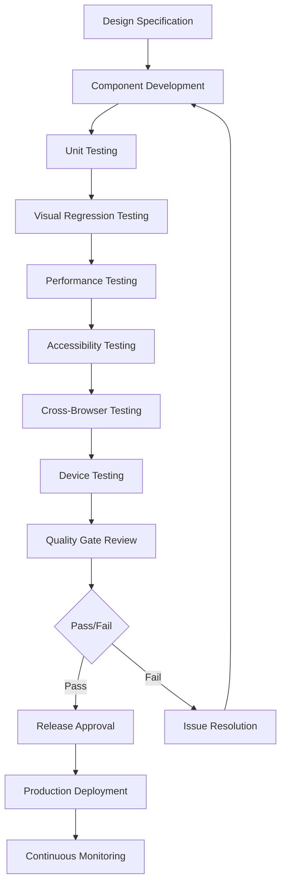

# Apple Liquid Glass Testing & Quality Assurance Specification

## 1. Product Overview

This document establishes comprehensive testing protocols and quality assurance standards for the ScreenScape 2.0 Apple Liquid Glass design system implementation. The specification ensures pixel-perfect visual fidelity, optimal performance, full accessibility compliance, and cross-platform compatibility that meets Apple's exacting standards.

The testing framework validates every aspect of the implementation against Apple's official design resources and Human Interface Guidelines, ensuring the final product is indistinguishable from Apple's own applications in both appearance and behavior.

## 2. Core Features

### 2.1 Testing Categories

**Visual Regression Testing:**
- Pixel-perfect comparison against Apple's design resources
- Cross-browser rendering consistency validation
- Responsive behavior verification across all breakpoints
- Animation timing and smoothness accuracy testing

**Performance Testing:**
- 60fps animation frame rate validation
- Component rendering time measurement
- Memory usage profiling and optimization
- Bundle size impact analysis and optimization

**Accessibility Testing:**
- WCAG AA compliance verification
- Screen reader compatibility testing
- Keyboard navigation flow validation
- Dynamic type scaling support verification

**Cross-Platform Testing:**
- iPhone compatibility across all current models
- iPad adaptation and multitasking behavior
- Mac desktop implementation with hover states
- Safari, Chrome, and Firefox browser support

### 2.2 Quality Standards

**Visual Fidelity Requirements:**
- **Pixel Accuracy:** ±1px tolerance for all measurements
- **Color Accuracy:** Exact hex value matching with Apple's palette
- **Typography Precision:** San Francisco font rendering with correct weights
- **Material Authenticity:** Glass effects indistinguishable from iOS/macOS

**Performance Benchmarks:**
- **Initial Load:** < 2 seconds on 3G networks
- **Animation Performance:** Consistent 60fps across all devices
- **Memory Usage:** < 100MB baseline, < 200MB peak
- **Bundle Size:** < 500KB gzipped for design system core

**Accessibility Standards:**
- **Contrast Ratios:** 4.5:1 for normal text, 3:1 for large text
- **Touch Targets:** Minimum 44px for all interactive elements
- **Keyboard Navigation:** Full functionality without mouse/touch
- **Screen Reader:** Complete VoiceOver/NVDA compatibility

### 2.3 Testing Matrix

| Test Category | Test Type | Success Criteria | Tools & Methods |
|---------------|-----------|------------------|-----------------|
| **Visual** | Pixel Comparison | 99.9% visual accuracy | Percy, Chromatic, Manual inspection |
| **Visual** | Responsive Design | Perfect adaptation across breakpoints | BrowserStack, Device testing |
| **Performance** | Animation Smoothness | 60fps sustained performance | Chrome DevTools, Performance API |
| **Performance** | Load Times | < 2s initial load, < 500ms interactions | Lighthouse, WebPageTest |
| **Accessibility** | Screen Reader | 100% content accessible | VoiceOver, NVDA, JAWS testing |
| **Accessibility** | Keyboard Navigation | Complete keyboard functionality | Manual testing, axe-core |
| **Compatibility** | Cross-Browser | Identical experience across browsers | Selenium, Manual testing |
| **Compatibility** | Cross-Device | Consistent behavior on all devices | Physical device testing |

## 3. Core Process

### 3.1 Testing Workflow

**Pre-Implementation Testing:**
1. Design resource validation against Apple's official specifications
2. Component specification review for accuracy and completeness
3. Performance baseline establishment for comparison metrics
4. Accessibility requirement definition and validation criteria

**Development Testing:**
1. Unit testing for component logic and prop handling
2. Integration testing for design system cohesion
3. Visual regression testing during development iterations
4. Performance monitoring with real-time feedback

**Pre-Release Testing:**
1. Comprehensive cross-browser compatibility validation
2. Device-specific testing on physical hardware
3. Accessibility audit with assistive technology
4. Performance benchmarking against Apple's standards

**Post-Release Monitoring:**
1. Continuous performance monitoring in production
2. User feedback collection and analysis
3. Accessibility compliance ongoing validation
4. Visual consistency maintenance across updates

### 3.2 Quality Assurance Flow



## 4. User Interface Design

### 4.1 Visual Testing Standards

**Design Resource Comparison:**
- **Apple Design Resources:** Official iOS and macOS design templates
- **SF Symbols Library:** Complete icon set with weight variations
- **Color Palette Validation:** System colors with exact hex values
- **Typography Specimens:** San Francisco font family samples

**Testing Methodology:**
- **Overlay Comparison:** Direct overlay of implementation over Apple resources
- **Pixel Diff Analysis:** Automated pixel-by-pixel comparison
- **Color Sampling:** Exact color value verification using digital color meters
- **Typography Metrics:** Font rendering comparison with Apple's specifications

### 4.2 Responsive Testing Matrix

| Device Category | Screen Sizes | Testing Focus | Validation Criteria |
|----------------|--------------|---------------|-------------------|
| **iPhone** | 375px-428px | Touch interactions, single-column layouts | Perfect adaptation, 44px touch targets |
| **iPad** | 768px-1024px | Two-column layouts, multitasking | Adaptive sizing, sidebar behavior |
| **Mac** | 1280px-5120px | Multi-column layouts, hover states | Desktop interactions, keyboard navigation |
| **Apple Watch** | 312px-396px | Simplified interfaces, large text | Essential functionality, readability |

### 4.3 Animation Testing Specifications

**Timing Curve Validation:**
- **Spring Animations:** Damping 0.6, stiffness 100
- **Ease-in-out:** Cubic-bezier(0.4, 0, 0.2, 1)
- **Gentle Transitions:** Cubic-bezier(0.25, 0.1, 0.25, 1)
- **Snappy Interactions:** Cubic-bezier(0.4, 0, 0.6, 1)

**Performance Metrics:**
- **Frame Rate:** Consistent 60fps during animations
- **Jank Detection:** Zero dropped frames during interactions
- **Memory Impact:** No memory leaks during repeated animations
- **CPU Usage:** < 30% CPU utilization during complex animations

## 5. Technical Implementation

### 5.1 Automated Testing Framework

**Visual Regression Testing Setup:**
```typescript
// Percy Visual Testing Configuration
import { percySnapshot } from '@percy/playwright';

describe('Apple Liquid Glass Components', () => {
  test('Glass Button Visual Regression', async ({ page }) => {
    await page.goto('/components/glass-button');
    
    // Test all variants and states
    const variants = ['primary', 'secondary', 'accent'];
    const sizes = ['small', 'medium', 'large'];
    const states = ['default', 'hover', 'active', 'disabled'];
    
    for (const variant of variants) {
      for (const size of sizes) {
        for (const state of states) {
          await page.locator(`[data-testid="button-${variant}-${size}"]`).hover();
          await percySnapshot(page, `Glass Button - ${variant} ${size} ${state}`);
        }
      }
    }
  });
});
```

**Performance Testing Implementation:**
```typescript
// Performance Monitoring
import { performance, PerformanceObserver } from 'perf_hooks';

class PerformanceMonitor {
  private observer: PerformanceObserver;
  
  constructor() {
    this.observer = new PerformanceObserver((list) => {
      const entries = list.getEntries();
      entries.forEach((entry) => {
        if (entry.entryType === 'measure') {
          console.log(`${entry.name}: ${entry.duration}ms`);
          // Assert performance benchmarks
          expect(entry.duration).toBeLessThan(16); // 60fps = 16.67ms per frame
        }
      });
    });
    this.observer.observe({ entryTypes: ['measure'] });
  }
  
  measureComponentRender(componentName: string, renderFunction: () => void) {
    performance.mark(`${componentName}-start`);
    renderFunction();
    performance.mark(`${componentName}-end`);
    performance.measure(componentName, `${componentName}-start`, `${componentName}-end`);
  }
}
```

**Accessibility Testing Automation:**
```typescript
// Accessibility Testing with axe-core
import { axe, toHaveNoViolations } from 'jest-axe';

expect.extend(toHaveNoViolations);

describe('Accessibility Compliance', () => {
  test('Glass Components have no accessibility violations', async () => {
    const { container } = render(<GlassComponentLibrary />);
    const results = await axe(container);
    expect(results).toHaveNoViolations();
  });
  
  test('Keyboard navigation works correctly', async () => {
    const { container } = render(<GlassButton>Test Button</GlassButton>);
    const button = container.querySelector('button');
    
    // Test focus
    button?.focus();
    expect(document.activeElement).toBe(button);
    
    // Test keyboard activation
    fireEvent.keyDown(button!, { key: 'Enter' });
    expect(mockOnPress).toHaveBeenCalled();
  });
});
```

### 5.2 Cross-Browser Testing Configuration

**Browser Testing Matrix:**
```typescript
// Playwright Cross-Browser Configuration
import { devices, PlaywrightTestConfig } from '@playwright/test';

const config: PlaywrightTestConfig = {
  projects: [
    {
      name: 'Safari',
      use: { ...devices['Desktop Safari'] },
    },
    {
      name: 'Chrome',
      use: { ...devices['Desktop Chrome'] },
    },
    {
      name: 'Firefox',
      use: { ...devices['Desktop Firefox'] },
    },
    {
      name: 'iPhone 14',
      use: { ...devices['iPhone 14'] },
    },
    {
      name: 'iPad Pro',
      use: { ...devices['iPad Pro'] },
    },
  ],
};

export default config;
```

### 5.3 Device Testing Protocols

**Physical Device Testing:**
- **iPhone Models:** 12 Mini, 13, 14 Pro, 14 Pro Max
- **iPad Models:** Air (5th gen), Pro 11" (4th gen), Pro 12.9" (6th gen)
- **Mac Models:** MacBook Air M2, iMac 24", Studio Display

**Testing Scenarios:**
```typescript
// Device-Specific Test Scenarios
const deviceTests = {
  iPhone: {
    touchTargets: '44px minimum size validation',
    singleColumn: 'Layout adaptation verification',
    dynamicType: 'Text scaling from xSmall to xxxLarge',
    darkMode: 'Automatic theme switching',
  },
  iPad: {
    twoColumn: 'Adaptive layout with sidebar',
    multitasking: 'Split view and slide over compatibility',
    pencilSupport: 'Apple Pencil interaction handling',
    keyboardShortcuts: 'External keyboard support',
  },
  Mac: {
    hoverStates: 'Mouse interaction feedback',
    keyboardNav: 'Full keyboard accessibility',
    windowResize: 'Responsive behavior during resize',
    multiDisplay: 'External display compatibility',
  },
};
```

## 6. Quality Assurance

### 6.1 Acceptance Criteria

**Visual Fidelity Checklist:**
- [ ] All components match Apple's design resources within ±1px tolerance
- [ ] Color values exactly match Apple's system palette
- [ ] Typography uses San Francisco font family with correct weights
- [ ] Glass material effects are indistinguishable from iOS/macOS
- [ ] Animations follow Apple's timing curves precisely

**Performance Benchmarks:**
- [ ] Initial page load completes in < 2 seconds on 3G
- [ ] All animations maintain 60fps performance
- [ ] Memory usage stays below 200MB peak
- [ ] Bundle size remains under 500KB gzipped
- [ ] No performance regressions compared to baseline

**Accessibility Compliance:**
- [ ] Zero violations in automated accessibility testing
- [ ] Complete keyboard navigation functionality
- [ ] Screen reader compatibility with VoiceOver, NVDA, JAWS
- [ ] Proper contrast ratios for all text elements
- [ ] Dynamic type scaling support up to 200%

**Cross-Platform Compatibility:**
- [ ] Identical visual appearance across Safari, Chrome, Firefox
- [ ] Consistent behavior on iPhone, iPad, and Mac
- [ ] Proper responsive adaptation at all breakpoints
- [ ] Touch and mouse interactions work correctly
- [ ] Dark mode switching functions properly

### 6.2 Testing Schedule

**Development Phase Testing:**
- **Daily:** Unit tests and component integration tests
- **Weekly:** Visual regression testing and performance monitoring
- **Sprint End:** Comprehensive accessibility and cross-browser testing

**Pre-Release Testing:**
- **Feature Complete:** Full device testing matrix execution
- **Release Candidate:** Final visual comparison with Apple resources
- **Production Deploy:** Performance baseline establishment

**Post-Release Monitoring:**
- **Daily:** Performance metrics monitoring
- **Weekly:** User feedback analysis and issue triage
- **Monthly:** Comprehensive accessibility audit
- **Quarterly:** Full design system review and updates

### 6.3 Quality Gates

**Component Release Criteria:**
1. **Visual Accuracy:** 99.9% match with Apple design resources
2. **Performance:** All benchmarks met or exceeded
3. **Accessibility:** Zero violations in automated testing
4. **Cross-Browser:** Consistent experience across target browsers
5. **Documentation:** Complete API documentation and usage examples

**System Release Criteria:**
1. **Integration Testing:** All components work together seamlessly
2. **Performance Testing:** System-wide performance meets benchmarks
3. **User Testing:** Positive feedback from target user groups
4. **Security Review:** No security vulnerabilities identified
5. **Legal Compliance:** Adherence to Apple's design guidelines

This comprehensive testing and quality assurance specification ensures that the ScreenScape 2.0 Apple Liquid Glass implementation meets the highest standards of visual fidelity, performance, accessibility, and cross-platform compatibility, delivering an experience that is indistinguishable from Apple's own applications.