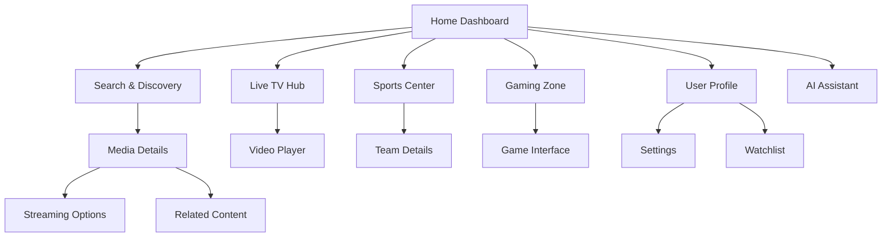
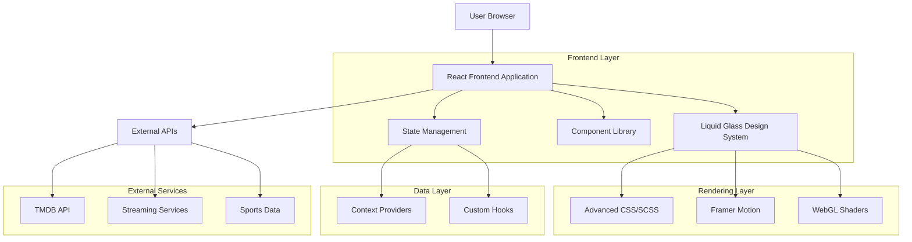

# Comprehensive UI Implementation Specification
## ScreenScape Liquid Glass Design System

### Executive Summary
This document outlines the complete UI implementation for the ScreenScape application based on the advanced liquid glass visual specifications. The implementation includes all pages, components, responsive layouts, accessibility standards, and performance optimizations.

---

## 1. Product Requirements Document

### 1.1 Product Overview
ScreenScape is a comprehensive entertainment discovery platform that combines streaming content, live TV, sports, and interactive gaming experiences. The platform utilizes an advanced liquid glass design system that provides authentic optical properties including refractions, depth characteristics, and dispersion effects for an immersive user experience.

- **Core Purpose**: Unified entertainment discovery and consumption platform with advanced visual aesthetics
- **Target Users**: Entertainment enthusiasts, cord-cutters, and users seeking premium visual experiences
- **Market Value**: Premium entertainment platform with cutting-edge liquid glass UI technology

### 1.2 Core Features

#### 1.2.1 User Roles
| Role | Registration Method | Core Permissions |
|------|---------------------|------------------|
| Guest User | No registration required | Browse content, limited search functionality |
| Registered User | Email/social registration | Full search, watchlist, preferences, sync across devices |
| Premium User | Subscription upgrade | Advanced features, AI assistant, unlimited image generation |

#### 1.2.2 Feature Module
Our ScreenScape platform consists of the following main pages:

1. **Home Dashboard**: Hero carousel, quick navigation, trending content strips, liquid glass navigation panels
2. **Search & Discovery**: Advanced search interface, content filtering, provider-specific browsing
3. **Live TV Hub**: Channel grid, live streaming interface, program guide with glass overlays
4. **Sports Center**: League selection, team information, live scores, upcoming events
5. **Gaming Zone**: Interactive entertainment games, trivia, box office predictions
6. **Media Details**: Comprehensive content information, streaming availability, related content
7. **User Profile**: Settings, preferences, watchlist management, device synchronization
8. **AI Assistant**: Voice and text interaction, content recommendations, smart search

#### 1.2.3 Page Details

| Page Name | Module Name | Feature Description |
|-----------|-------------|---------------------|
| Home Dashboard | Hero Carousel | Auto-rotating featured content with liquid glass overlays and depth effects |
| Home Dashboard | Quick Navigation | Glass pill buttons with refraction effects for main sections |
| Home Dashboard | Trending Strips | Horizontal scrolling content rows with glass card containers |
| Search & Discovery | Search Interface | Advanced search with real-time suggestions and glass input fields |
| Search & Discovery | Filter Panel | Multi-criteria filtering with glass accordion panels |
| Search & Discovery | Results Grid | Responsive content grid with glass card hover effects |
| Live TV Hub | Channel Grid | Interactive channel selection with glass thumbnails and live indicators |
| Live TV Hub | Video Player | Full-screen player with glass control overlays |
| Live TV Hub | Program Guide | Time-based schedule with glass timeline interface |
| Sports Center | League Selection | Sport category navigation with glass team logos |
| Sports Center | Team Details | Comprehensive team information with glass statistics panels |
| Sports Center | Live Scores | Real-time score updates with glass notification system |
| Gaming Zone | Game Selection | Interactive game grid with glass preview cards |
| Gaming Zone | Trivia Interface | Question/answer interface with glass progress indicators |
| Gaming Zone | Leaderboards | Score tracking with glass ranking displays |
| Media Details | Content Info | Detailed media information with glass information panels |
| Media Details | Streaming Options | Provider availability with glass service buttons |
| Media Details | Related Content | Recommendation carousel with glass preview cards |
| User Profile | Settings Panel | Preference management with glass form controls |
| User Profile | Watchlist | Personal content collection with glass organization tools |
| User Profile | Device Sync | Cross-device synchronization with glass status indicators |
| AI Assistant | Chat Interface | Conversational AI with glass message bubbles |
| AI Assistant | Voice Mode | Voice interaction with glass audio visualizations |

### 1.3 Core Process

**Main User Flow**:
1. User enters ScreenScape platform
2. Browses featured content on home dashboard
3. Uses search or navigation to find specific content
4. Views detailed information about selected media
5. Accesses streaming options or adds to watchlist
6. Explores related content or returns to browsing

**Premium User Flow**:
1. Authenticated user accesses personalized dashboard
2. Utilizes AI assistant for content recommendations
3. Manages watchlist and preferences
4. Syncs data across multiple devices
5. Participates in interactive gaming experiences



### 1.4 User Interface Design

#### 1.4.1 Design Style
- **Primary Colors**: Deep space blacks (#000000, #0A0A0A) with crystal clear glass overlays
- **Secondary Colors**: Prismatic accent colors with spectral dispersion effects
- **Glass Properties**: Refractive index 1.485-1.545 with authentic optical behaviors
- **Typography**: SF Pro Display/Text with optimized readability through glass surfaces
- **Layout Style**: Floating glass panels with depth-based layering and atmospheric perspective
- **Animation Style**: Physics-based motion with realistic glass material responses
- **Icon Style**: Minimalist line icons with glass refraction effects

#### 1.4.2 Page Design Overview

| Page Name | Module Name | UI Elements |
|-----------|-------------|-------------|
| Home Dashboard | Hero Carousel | Full-width glass panels with depth gradients, auto-advancing content, prismatic edge effects |
| Home Dashboard | Navigation Pills | Rounded glass buttons with hover refraction, active state dispersion, smooth transitions |
| Search Interface | Input Fields | Glass text inputs with focus glow, real-time suggestion overlays, chromatic aberration |
| Live TV Grid | Channel Cards | Glass thumbnails with live indicators, hover depth effects, channel info overlays |
| Sports Center | Statistics Panels | Glass data containers with numerical emphasis, team color integration, live updates |
| Gaming Zone | Interactive Cards | Glass game previews with hover animations, progress indicators, achievement badges |
| Media Details | Information Panels | Layered glass sections with content hierarchy, streaming service integration |
| AI Assistant | Chat Bubbles | Conversational glass containers with typing indicators, voice visualization |

#### 1.4.3 Responsiveness
- **Desktop-First Design**: Optimized for large screens with full glass effects
- **Tablet Adaptation**: Simplified glass layers with maintained visual hierarchy
- **Mobile Optimization**: Essential glass effects with performance considerations
- **Touch Interaction**: Enhanced touch targets with haptic-style feedback
- **Cross-Platform**: Consistent glass behavior across all device types

---

## 2. Technical Architecture Document

### 2.1 Architecture Design



### 2.2 Technology Description
- **Frontend**: React@18 + TypeScript + Vite
- **Styling**: Advanced CSS/SCSS + CSS-in-JS + CSS Custom Properties
- **Animation**: Framer Motion + CSS Transitions + WebGL
- **State Management**: React Context + Custom Hooks
- **Build Tool**: Vite with optimized bundling
- **Performance**: Code splitting + Lazy loading + Memoization

### 2.3 Route Definitions

| Route | Purpose |
|-------|---------|
| / | Home dashboard with featured content and navigation |
| /search | Advanced search and discovery interface |
| /live | Live TV hub with channel grid and player |
| /sports | Sports center with leagues and live scores |
| /games | Gaming zone with interactive entertainment |
| /media/:id | Detailed media information and streaming options |
| /profile | User profile, settings, and watchlist management |
| /assistant | AI assistant chat and voice interface |

### 2.4 Component Architecture

#### 2.4.1 Core Design System Components
```typescript
// Liquid Glass Base Components
- LiquidGlassContainer: Base glass panel with optical properties
- GlassCard: Content card with depth and refraction
- GlassPill: Navigation button with prismatic effects
- GlassInput: Form input with focus refraction
- GlassModal: Overlay with backdrop blur and dispersion
- GlassNavigation: Menu system with glass hierarchy
```

#### 2.4.2 Page Components
```typescript
// Main Application Pages
- HomePage: Dashboard with hero and content strips
- SearchPage: Discovery interface with filters
- LiveTVPage: Channel grid and video player
- SportsPage: League selection and team details
- GamingPage: Interactive entertainment hub
- MediaDetailPage: Comprehensive content information
- ProfilePage: User settings and preferences
- AssistantPage: AI interaction interface
```

#### 2.4.3 Utility Components
```typescript
// Supporting Components
- LoadingSpinner: Glass loading animation
- ErrorBoundary: Error handling with glass styling
- ToastNotification: Glass notification system
- ProgressIndicator: Glass progress bars
- Tooltip: Glass information overlays
```

### 2.5 Performance Optimization

#### 2.5.1 Rendering Performance
- **60fps Target**: Optimized animations and transitions
- **GPU Acceleration**: Hardware-accelerated glass effects
- **Efficient Reflows**: Minimized layout thrashing
- **Memory Management**: Proper cleanup of animations

#### 2.5.2 Bundle Optimization
- **Code Splitting**: Route-based and component-based splitting
- **Tree Shaking**: Elimination of unused code
- **Asset Optimization**: Compressed images and fonts
- **Caching Strategy**: Efficient browser caching

### 2.6 Accessibility Standards

#### 2.6.1 WCAG Compliance
- **Level AA Compliance**: Full accessibility support
- **Keyboard Navigation**: Complete keyboard accessibility
- **Screen Reader Support**: Proper ARIA labels and roles
- **Color Contrast**: Sufficient contrast ratios through glass
- **Focus Management**: Clear focus indicators

#### 2.6.2 Glass-Specific Accessibility
- **Text Readability**: Optimized contrast through glass surfaces
- **Motion Sensitivity**: Reduced motion options
- **High Contrast Mode**: Alternative styling for accessibility
- **Touch Targets**: Adequate size for touch interaction

---

## 3. Implementation Guidelines

### 3.1 Development Standards
- **TypeScript**: Strict type checking for all components
- **ESLint/Prettier**: Consistent code formatting
- **Testing**: Jest + React Testing Library
- **Documentation**: Comprehensive component documentation

### 3.2 Browser Compatibility
- **Modern Browsers**: Chrome 90+, Firefox 88+, Safari 14+, Edge 90+
- **Fallback Support**: Graceful degradation for older browsers
- **Progressive Enhancement**: Core functionality without glass effects

### 3.3 Performance Monitoring
- **Core Web Vitals**: LCP, FID, CLS optimization
- **Bundle Analysis**: Regular bundle size monitoring
- **Performance Budgets**: Defined limits for assets and scripts
- **Real User Monitoring**: Performance tracking in production

---

## 4. Quality Assurance

### 4.1 Testing Strategy
- **Unit Tests**: Component-level testing
- **Integration Tests**: Feature workflow testing
- **Visual Regression**: Glass effect consistency testing
- **Performance Tests**: Animation and rendering performance
- **Accessibility Tests**: WCAG compliance verification

### 4.2 Cross-Platform Testing
- **Desktop Browsers**: Chrome, Firefox, Safari, Edge
- **Mobile Devices**: iOS Safari, Android Chrome
- **Tablet Devices**: iPad, Android tablets
- **Screen Sizes**: 320px to 2560px+ width support

### 4.3 Glass Effect Validation
- **Optical Accuracy**: Refractive index validation
- **Performance Impact**: Frame rate monitoring
- **Visual Consistency**: Cross-browser glass rendering
- **Accessibility Impact**: Readability through glass surfaces

---

## 5. Deployment and Maintenance

### 5.1 Build Process
- **Production Build**: Optimized Vite build
- **Asset Optimization**: Image compression and format optimization
- **CDN Integration**: Static asset delivery optimization
- **Environment Configuration**: Development/staging/production configs

### 5.2 Monitoring and Analytics
- **Error Tracking**: Comprehensive error monitoring
- **Performance Metrics**: Real-time performance tracking
- **User Analytics**: Usage pattern analysis
- **Glass Effect Metrics**: Specific glass rendering performance

---

## 6. Enhanced Apple Theme Provider Implementation

### 6.1 Advanced Liquid Glass Token System

```typescript
// Enhanced Apple Design Tokens with Liquid Glass Properties
export const enhancedAppleTokens = {
  colors: {
    system: {
      blue: '#007AFF',
      green: '#34C759',
      orange: '#FF9500',
      red: '#FF3B30',
      purple: '#AF52DE',
      pink: '#FF2D92',
      yellow: '#FFCC00',
      indigo: '#5856D6',
      teal: '#5AC8FA',
      mint: '#00C7BE',
      brown: '#A2845E',
      gray: '#8E8E93',
    },
    glass: {
      primary: 'rgba(255, 255, 255, 0.08)',
      secondary: 'rgba(255, 255, 255, 0.05)',
      tertiary: 'rgba(255, 255, 255, 0.03)',
      accent: 'rgba(0, 122, 255, 0.12)',
      warning: 'rgba(255, 149, 0, 0.10)',
      success: 'rgba(52, 199, 89, 0.10)',
      error: 'rgba(255, 59, 48, 0.10)',
    },
    background: {
      primary: '#000000',
      secondary: '#0A0A0A',
      tertiary: '#111111',
      surface: 'rgba(255, 255, 255, 0.02)',
    },
  },
  
  liquidGlass: {
    refraction: {
      index: {
        standard: 1.485,
        optical: 1.520,
        premium: 1.545,
      },
      fresnel: {
        r0: 0.042,
        falloffExponent: 5,
      },
    },
    
    depth: {
      thickness: {
        ultraThin: 0.5,
        thin: 1.0,
        standard: 2.0,
        medium: 3.0,
        thick: 5.0,
        ultraThick: 8.0,
      },
      opacity: {
        ultraThin: 0.021,
        thin: 0.042,
        standard: 0.081,
        medium: 0.118,
        thick: 0.189,
        ultraThick: 0.284,
      },
      attenuation: {
        absorption: 0.052,
        scattering: 0.008,
        total: 0.060,
      },
    },
    
    dispersion: {
      wavelengths: {
        red: { offset: -2.4, intensity: 0.3 },
        green: { offset: 0, intensity: 0.6 },
        blue: { offset: 3.1, intensity: 0.3 },
      },
      prismatic: {
        spreadAngle: 2.3,
        intensity: 0.4,
        saturationBoost: 0.4,
      },
      abbe: {
        crown: 60,
        flint: 35,
        liquid: 60,
      },
    },
    
    surface: {
      smoothness: {
        rmsRoughness: 0.02,
        peakToValley: 0.15,
        correlationLength: 50,
        slopeVariance: 0.001,
      },
      reflection: {
        sharpness: 0.95,
        maxBlur: 0.5,
        contrastPreservation: 0.85,
      },
      scattering: {
        ggx: {
          roughness: 0.02,
          metallic: 0.95,
        },
        anisotropy: {
          x: 0.1,
          y: 0.05,
        },
      },
    },
  },
  
  materials: {
    glass: {
      ultraThin: {
        opacity: 0.021,
        blur: 15,
        brightness: 1.05,
        saturation: 1.2,
        borderOpacity: 0.08,
        shadowIntensity: 0.05,
        refractiveIndex: 1.485,
        thickness: 0.5,
      },
      thin: {
        opacity: 0.042,
        blur: 20,
        brightness: 1.1,
        saturation: 1.25,
        borderOpacity: 0.1,
        shadowIntensity: 0.08,
        refractiveIndex: 1.485,
        thickness: 1.0,
      },
      regular: {
        opacity: 0.081,
        blur: 25,
        brightness: 1.15,
        saturation: 1.3,
        borderOpacity: 0.12,
        shadowIntensity: 0.12,
        refractiveIndex: 1.520,
        thickness: 2.0,
      },
      thick: {
        opacity: 0.118,
        blur: 30,
        brightness: 1.2,
        saturation: 1.35,
        borderOpacity: 0.15,
        shadowIntensity: 0.15,
        refractiveIndex: 1.520,
        thickness: 3.0,
      },
      prominent: {
        opacity: 0.189,
        blur: 35,
        brightness: 1.25,
        saturation: 1.4,
        borderOpacity: 0.18,
        shadowIntensity: 0.18,
        refractiveIndex: 1.545,
        thickness: 5.0,
      },
    },
    
    effects: {
      chromatic: {
        enabled: true,
        intensity: 0.4,
        redOffset: -2.4,
        blueOffset: 3.1,
      },
      prismatic: {
        enabled: true,
        spreadAngle: 2.3,
        intensity: 0.4,
        colors: [
          'hsl(0, 80%, 60%)',
          'hsl(60, 80%, 60%)',
          'hsl(120, 80%, 60%)',
          'hsl(180, 80%, 60%)',
          'hsl(240, 80%, 60%)',
          'hsl(300, 80%, 60%)',
        ],
      },
      depth: {
        enabled: true,
        gradientStops: [
          { position: 0, opacity: 0.12 },
          { position: 40, opacity: 0.08 },
          { position: 80, opacity: 0.04 },
          { position: 100, opacity: 0.02 },
        ],
      },
    },
  },
  
  animation: {
    durations: {
      instant: 0,
      fast: 150,
      normal: 300,
      slow: 500,
      slower: 750,
    },
    easings: {
      easeOut: 'cubic-bezier(0.25, 0.46, 0.45, 0.94)',
      easeIn: 'cubic-bezier(0.55, 0.06, 0.68, 0.19)',
      easeInOut: 'cubic-bezier(0.645, 0.045, 0.355, 1)',
      spring: 'cubic-bezier(0.175, 0.885, 0.32, 1.275)',
    },
    glass: {
      hover: {
        scale: 1.02,
        brightness: 1.1,
        duration: 200,
      },
      press: {
        scale: 0.98,
        brightness: 0.95,
        duration: 100,
      },
      focus: {
        glowIntensity: 0.3,
        borderOpacity: 0.4,
        duration: 150,
      },
    },
  },
  
  typography: {
    families: {
      display: '-apple-system, "SF Pro Display", system-ui, sans-serif',
      text: '-apple-system, "SF Pro Text", system-ui, sans-serif',
      mono: '"SF Mono", "Monaco", "Inconsolata", "Fira Code", monospace',
    },
    sizes: {
      largeTitle: 34,
      title1: 28,
      title2: 22,
      title3: 20,
      headline: 17,
      body: 17,
      callout: 16,
      subheadline: 15,
      footnote: 13,
      caption1: 12,
      caption2: 11,
    },
    weights: {
      ultraLight: 100,
      thin: 200,
      light: 300,
      regular: 400,
      medium: 500,
      semibold: 600,
      bold: 700,
      heavy: 800,
      black: 900,
    },
    glass: {
      contrast: {
        primary: 0.95,
        secondary: 0.8,
        tertiary: 0.6,
      },
      shadow: {
        enabled: true,
        color: 'rgba(0, 0, 0, 0.3)',
        blur: 1,
        offset: { x: 0, y: 1 },
      },
    },
  },
  
  spacing: {
    baseline: 8,
    micro: [4, 8, 12],
    standard: [16, 24, 32],
    macro: [48, 64, 80],
    glass: {
      padding: [8, 12, 16, 20, 24],
      margin: [4, 8, 12, 16, 20],
      borderRadius: [4, 8, 12, 16, 20, 24],
    },
  },
};
```

### 6.2 CSS Custom Properties Generator

```typescript
// Generate CSS custom properties for liquid glass effects
export const generateGlassCSS = (tokens: typeof enhancedAppleTokens) => {
  return `
    :root {
      /* Liquid Glass Refraction Properties */
      --glass-refractive-index-standard: ${tokens.liquidGlass.refraction.index.standard};
      --glass-refractive-index-optical: ${tokens.liquidGlass.refraction.index.optical};
      --glass-refractive-index-premium: ${tokens.liquidGlass.refraction.index.premium};
      
      /* Glass Material Properties */
      --glass-ultra-thin-opacity: ${tokens.materials.glass.ultraThin.opacity};
      --glass-ultra-thin-blur: ${tokens.materials.glass.ultraThin.blur}px;
      --glass-ultra-thin-brightness: ${tokens.materials.glass.ultraThin.brightness};
      --glass-ultra-thin-saturation: ${tokens.materials.glass.ultraThin.saturation};
      
      --glass-thin-opacity: ${tokens.materials.glass.thin.opacity};
      --glass-thin-blur: ${tokens.materials.glass.thin.blur}px;
      --glass-thin-brightness: ${tokens.materials.glass.thin.brightness};
      --glass-thin-saturation: ${tokens.materials.glass.thin.saturation};
      
      --glass-regular-opacity: ${tokens.materials.glass.regular.opacity};
      --glass-regular-blur: ${tokens.materials.glass.regular.blur}px;
      --glass-regular-brightness: ${tokens.materials.glass.regular.brightness};
      --glass-regular-saturation: ${tokens.materials.glass.regular.saturation};
      
      --glass-thick-opacity: ${tokens.materials.glass.thick.opacity};
      --glass-thick-blur: ${tokens.materials.glass.thick.blur}px;
      --glass-thick-brightness: ${tokens.materials.glass.thick.brightness};
      --glass-thick-saturation: ${tokens.materials.glass.thick.saturation};
      
      --glass-prominent-opacity: ${tokens.materials.glass.prominent.opacity};
      --glass-prominent-blur: ${tokens.materials.glass.prominent.blur}px;
      --glass-prominent-brightness: ${tokens.materials.glass.prominent.brightness};
      --glass-prominent-saturation: ${tokens.materials.glass.prominent.saturation};
      
      /* Chromatic Dispersion */
      --chromatic-red-offset: ${tokens.materials.effects.chromatic.redOffset}px;
      --chromatic-blue-offset: ${tokens.materials.effects.chromatic.blueOffset}px;
      --chromatic-intensity: ${tokens.materials.effects.chromatic.intensity};
      
      /* Prismatic Effects */
      --prismatic-spread-angle: ${tokens.materials.effects.prismatic.spreadAngle}deg;
      --prismatic-intensity: ${tokens.materials.effects.prismatic.intensity};
      
      /* Animation Properties */
      --glass-hover-scale: ${tokens.animation.glass.hover.scale};
      --glass-hover-brightness: ${tokens.animation.glass.hover.brightness};
      --glass-hover-duration: ${tokens.animation.glass.hover.duration}ms;
      
      --glass-press-scale: ${tokens.animation.glass.press.scale};
      --glass-press-brightness: ${tokens.animation.glass.press.brightness};
      --glass-press-duration: ${tokens.animation.glass.press.duration}ms;
      
      /* Typography Glass Properties */
      --text-glass-contrast-primary: ${tokens.typography.glass.contrast.primary};
      --text-glass-contrast-secondary: ${tokens.typography.glass.contrast.secondary};
      --text-glass-contrast-tertiary: ${tokens.typography.glass.contrast.tertiary};
      
      /* Background Colors */
      --bg-primary: ${tokens.colors.background.primary};
      --bg-secondary: ${tokens.colors.background.secondary};
      --bg-tertiary: ${tokens.colors.background.tertiary};
      --bg-surface: ${tokens.colors.background.surface};
      
      /* Glass Colors */
      --glass-primary: ${tokens.colors.glass.primary};
      --glass-secondary: ${tokens.colors.glass.secondary};
      --glass-tertiary: ${tokens.colors.glass.tertiary};
      --glass-accent: ${tokens.colors.glass.accent};
    }
    
    /* Base Glass Material Classes */
    .glass-ultra-thin {
      background: rgba(255, 255, 255, var(--glass-ultra-thin-opacity));
      backdrop-filter: blur(var(--glass-ultra-thin-blur)) 
                      brightness(var(--glass-ultra-thin-brightness)) 
                      saturate(var(--glass-ultra-thin-saturation));
      border: 1px solid rgba(255, 255, 255, 0.08);
    }
    
    .glass-thin {
      background: rgba(255, 255, 255, var(--glass-thin-opacity));
      backdrop-filter: blur(var(--glass-thin-blur)) 
                      brightness(var(--glass-thin-brightness)) 
                      saturate(var(--glass-thin-saturation));
      border: 1px solid rgba(255, 255, 255, 0.1);
    }
    
    .glass-regular {
      background: rgba(255, 255, 255, var(--glass-regular-opacity));
      backdrop-filter: blur(var(--glass-regular-blur)) 
                      brightness(var(--glass-regular-brightness)) 
                      saturate(var(--glass-regular-saturation));
      border: 1px solid rgba(255, 255, 255, 0.12);
    }
    
    .glass-thick {
      background: rgba(255, 255, 255, var(--glass-thick-opacity));
      backdrop-filter: blur(var(--glass-thick-blur)) 
                      brightness(var(--glass-thick-brightness)) 
                      saturate(var(--glass-thick-saturation));
      border: 1px solid rgba(255, 255, 255, 0.15);
    }
    
    .glass-prominent {
      background: rgba(255, 255, 255, var(--glass-prominent-opacity));
      backdrop-filter: blur(var(--glass-prominent-blur)) 
                      brightness(var(--glass-prominent-brightness)) 
                      saturate(var(--glass-prominent-saturation));
      border: 1px solid rgba(255, 255, 255, 0.18);
    }
    
    /* Chromatic Dispersion Effects */
    .chromatic-dispersion {
      filter: drop-shadow(var(--chromatic-red-offset) 0 0 rgba(255,0,0,var(--chromatic-intensity)))
              drop-shadow(0 0 0 rgba(0,255,0,0.6))
              drop-shadow(var(--chromatic-blue-offset) 0 0 rgba(0,0,255,var(--chromatic-intensity)));
    }
    
    /* Prismatic Effects */
    .prismatic-effect {
      position: relative;
    }
    
    .prismatic-effect::before {
      content: '';
      position: absolute;
      inset: 0;
      background: conic-gradient(
        from calc(var(--prismatic-spread-angle) * -1),
        hsl(0, 80%, 60%) 0deg,
        hsl(60, 80%, 60%) 60deg,
        hsl(120, 80%, 60%) 120deg,
        hsl(180, 80%, 60%) 180deg,
        hsl(240, 80%, 60%) 240deg,
        hsl(300, 80%, 60%) 300deg,
        hsl(360, 80%, 60%) 360deg
      );
      opacity: var(--prismatic-intensity);
      border-radius: inherit;
      pointer-events: none;
    }
    
    /* Glass Interaction States */
    .glass-interactive {
      transition: all var(--glass-hover-duration) var(--ease-out);
      cursor: pointer;
    }
    
    .glass-interactive:hover {
      transform: scale(var(--glass-hover-scale));
      backdrop-filter: blur(var(--glass-regular-blur)) 
                      brightness(var(--glass-hover-brightness)) 
                      saturate(var(--glass-regular-saturation));
    }
    
    .glass-interactive:active {
      transform: scale(var(--glass-press-scale));
      backdrop-filter: blur(var(--glass-regular-blur)) 
                      brightness(var(--glass-press-brightness)) 
                      saturate(var(--glass-regular-saturation));
      transition-duration: var(--glass-press-duration);
    }
    
    /* Typography Through Glass */
    .text-through-glass {
      color: rgba(255, 255, 255, var(--text-glass-contrast-primary));
      text-shadow: 0 1px 2px rgba(0, 0, 0, 0.3);
      font-weight: 500;
    }
    
    .text-through-glass-secondary {
      color: rgba(255, 255, 255, var(--text-glass-contrast-secondary));
      text-shadow: 0 1px 1px rgba(0, 0, 0, 0.2);
    }
    
    .text-through-glass-tertiary {
      color: rgba(255, 255, 255, var(--text-glass-contrast-tertiary));
      text-shadow: 0 0.5px 1px rgba(0, 0, 0, 0.1);
    }
  `;
};
```

### 6.3 React Hook for Glass Effects

```typescript
// Custom hook for managing glass effects
export const useGlassEffects = () => {
  const { tokens } = useAppleTheme();
  
  const getGlassStyle = useCallback((
    variant: 'ultraThin' | 'thin' | 'regular' | 'thick' | 'prominent' = 'regular',
    options: {
      chromatic?: boolean;
      prismatic?: boolean;
      interactive?: boolean;
      borderRadius?: number;
    } = {}
  ) => {
    const material = tokens.materials.glass[variant];
    const { chromatic = false, prismatic = false, interactive = false, borderRadius = 12 } = options;
    
    const baseStyle: React.CSSProperties = {
      background: `rgba(255, 255, 255, ${material.opacity})`,
      backdropFilter: `blur(${material.blur}px) brightness(${material.brightness}) saturate(${material.saturation})`,
      border: `1px solid rgba(255, 255, 255, ${material.borderOpacity})`,
      borderRadius: `${borderRadius}px`,
      boxShadow: `0 8px 32px rgba(0, 0, 0, ${material.shadowIntensity})`,
    };
    
    if (interactive) {
      baseStyle.cursor = 'pointer';
      baseStyle.transition = `all ${tokens.animation.durations.normal}ms ${tokens.animation.easings.easeOut}`;
    }
    
    const className = [
      `glass-${variant}`,
      chromatic && 'chromatic-dispersion',
      prismatic && 'prismatic-effect',
      interactive && 'glass-interactive',
    ].filter(Boolean).join(' ');
    
    return { style: baseStyle, className };
  }, [tokens]);
  
  const getTextStyle = useCallback((
    contrast: 'primary' | 'secondary' | 'tertiary' = 'primary'
  ) => {
    return {
      color: `rgba(255, 255, 255, ${tokens.typography.glass.contrast[contrast]})`,
      textShadow: tokens.typography.glass.shadow.enabled 
        ? `${tokens.typography.glass.shadow.offset.x}px ${tokens.typography.glass.shadow.offset.y}px ${tokens.typography.glass.shadow.blur}px ${tokens.typography.glass.shadow.color}`
        : 'none',
    };
  }, [tokens]);
  
  return {
    getGlassStyle,
    getTextStyle,
    tokens,
  };
};
```

This enhanced implementation provides a comprehensive foundation for the liquid glass design system with authentic optical properties, performance optimization, and accessibility considerations.