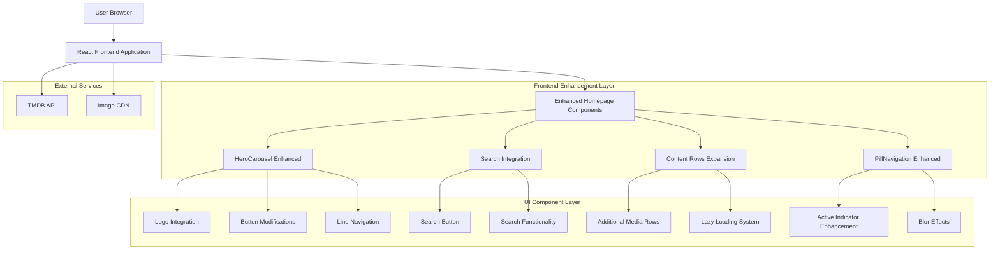

# ScreenScape 2.0 Homepage Enhancement Technical Architecture

## 1. Architecture Design



## 2. Technology Description

**Frontend Enhancements**: React@18 + TypeScript + Framer Motion + Apple Design System
**Styling**: CSS-in-JS with Apple Theme Provider + Glass Morphism Effects
**State Management**: React Hooks + Context API
**Performance**: Lazy Loading + Image Optimization + Bundle Splitting
**Accessibility**: WCAG 2.1 AA + ARIA Labels + Keyboard Navigation

## 3. Component Architecture

### 3.1 Enhanced Component Structure

| Component | Enhancement Type | Dependencies |
|-----------|-----------------|--------------|
| **HeroCarousel** | Button modifications, logo integration, navigation redesign | Framer Motion, Apple Theme Provider |
| **NetflixView** | Content expansion, search integration | MediaRow, Search components |
| **PillNavigation** | Active indicator styling, blur effects | Apple Theme Provider, CSS filters |
| **MediaRow** | Additional content rows, lazy loading | Intersection Observer API |
| **SearchButton** | New component for search functionality | Search service, debounce utility |

### 3.2 New Component Specifications

**SearchButton Component**
```typescript
interface SearchButtonProps {
  onSearch: (query: string) => void;
  placeholder?: string;
  className?: string;
}
```

**LogoDisplay Component**
```typescript
interface LogoDisplayProps {
  logoUrl: string;
  title: string;
  size: 'small' | 'medium' | 'large';
  position: 'left' | 'center' | 'right';
}
```

**LineNavigation Component**
```typescript
interface LineNavigationProps {
  items: number;
  activeIndex: number;
  onNavigate: (index: number) => void;
}
```

## 4. Styling Architecture

### 4.1 Enhanced Theme Tokens

```typescript
// Additional theme tokens for enhancements
const enhancementTokens = {
  navigation: {
    lineIndicator: {
      width: '32px',
      height: '3px',
      borderRadius: '2px',
      activeOpacity: 1.0,
      inactiveOpacity: 0.3,
      hoverOpacity: 0.6
    }
  },
  blur: {
    subtle: '2px',
    medium: '4px',
    strong: '8px'
  },
  transitions: {
    fast: '0.15s cubic-bezier(0.4, 0, 0.2, 1)',
    standard: '0.2s cubic-bezier(0.4, 0, 0.2, 1)',
    slow: '0.3s cubic-bezier(0.4, 0, 0.2, 1)'
  }
}
```

### 4.2 Glass Morphism Enhancements

```css
/* Enhanced glass effects for new components */
.glass-pill-button {
  background: rgba(255, 255, 255, 0.1);
  backdrop-filter: blur(20px);
  border: 1px solid rgba(255, 255, 255, 0.2);
  border-radius: 50px;
  box-shadow: 0 8px 32px rgba(0, 0, 0, 0.1);
}

.glass-active-indicator {
  background: linear-gradient(135deg, 
    rgba(0, 122, 255, 0.9) 0%, 
    rgba(88, 86, 214, 0.9) 100%);
  backdrop-filter: blur(2px);
  box-shadow: 0 4px 16px rgba(0, 122, 255, 0.3);
}

.line-navigation-indicator {
  background: rgba(255, 255, 255, 0.3);
  transition: all 0.2s cubic-bezier(0.4, 0, 0.2, 1);
}

.line-navigation-indicator.active {
  background: rgba(255, 255, 255, 1.0);
  box-shadow: 0 2px 8px rgba(255, 255, 255, 0.3);
}
```

## 5. Performance Optimization Strategy

### 5.1 Lazy Loading Implementation

```typescript
// Intersection Observer for content rows
const useLazyLoading = (threshold = 0.1) => {
  const [isVisible, setIsVisible] = useState(false);
  const ref = useRef<HTMLDivElement>(null);

  useEffect(() => {
    const observer = new IntersectionObserver(
      ([entry]) => {
        if (entry.isIntersecting) {
          setIsVisible(true);
          observer.disconnect();
        }
      },
      { threshold }
    );

    if (ref.current) {
      observer.observe(ref.current);
    }

    return () => observer.disconnect();
  }, [threshold]);

  return { ref, isVisible };
};
```

### 5.2 Image Optimization

```typescript
// Enhanced image loading with WebP support
const OptimizedImage: React.FC<ImageProps> = ({ src, alt, ...props }) => {
  const webpSrc = src.replace(/\.(jpg|jpeg|png)$/, '.webp');
  
  return (
    <picture>
      <source srcSet={webpSrc} type="image/webp" />
      
    </picture>
  );
};
```

## 6. Accessibility Implementation

### 6.1 Enhanced ARIA Support

```typescript
// Accessibility enhancements for new components
const AccessibleSearchButton: React.FC<SearchButtonProps> = ({ onSearch }) => {
  return (
    <button
      type="button"
      aria-label="Search movies and TV shows"
      aria-expanded={isSearchOpen}
      aria-haspopup="listbox"
      onClick={handleSearchToggle}
    >
      <Search aria-hidden="true" />
      <span className="sr-only">Search</span>
    </button>
  );
};

const AccessibleLineNavigation: React.FC<LineNavigationProps> = ({ 
  items, 
  activeIndex, 
  onNavigate 
}) => {
  return (
    <nav role="tablist" aria-label="Carousel navigation">
      {Array.from({ length: items }, (_, index) => (
        <button
          key={index}
          role="tab"
          aria-selected={index === activeIndex}
          aria-label={`Go to slide ${index + 1} of ${items}`}
          onClick={() => onNavigate(index)}
        />
      ))}
    </nav>
  );
};
```

### 6.2 Keyboard Navigation Enhancement

```typescript
// Enhanced keyboard navigation for pill menu
const useKeyboardNavigation = (items: NavigationItem[]) => {
  const handleKeyDown = useCallback((event: KeyboardEvent) => {
    switch (event.key) {
      case 'ArrowLeft':
        event.preventDefault();
        navigateToPrevious();
        break;
      case 'ArrowRight':
        event.preventDefault();
        navigateToNext();
        break;
      case 'Home':
        event.preventDefault();
        navigateToFirst();
        break;
      case 'End':
        event.preventDefault();
        navigateToLast();
        break;
    }
  }, []);

  return { handleKeyDown };
};
```

## 7. State Management Architecture

### 7.1 Enhanced Context Structure

```typescript
// Enhanced context for homepage state
interface HomepageContextType {
  // Existing state
  view: ViewType;
  selectedItem: MediaItem | null;
  
  // New state for enhancements
  searchQuery: string;
  searchResults: MediaItem[];
  contentRows: ContentRow[];
  isSearchActive: boolean;
  
  // Actions
  setSearchQuery: (query: string) => void;
  toggleSearch: () => void;
  loadAdditionalContent: () => void;
}

const HomepageContext = createContext<HomepageContextType | null>(null);
```

### 7.2 Custom Hooks for Enhanced Functionality

```typescript
// Custom hook for search functionality
const useEnhancedSearch = (apiKey: string) => {
  const [searchQuery, setSearchQuery] = useState('');
  const [searchResults, setSearchResults] = useState<MediaItem[]>([]);
  const [isLoading, setIsLoading] = useState(false);

  const performSearch = useCallback(
    debounce(async (query: string) => {
      if (!query.trim()) {
        setSearchResults([]);
        return;
      }

      setIsLoading(true);
      try {
        const results = await searchMulti(apiKey, query);
        setSearchResults(results.results || []);
      } catch (error) {
        console.error('Search error:', error);
      } finally {
        setIsLoading(false);
      }
    }, 300),
    [apiKey]
  );

  useEffect(() => {
    performSearch(searchQuery);
  }, [searchQuery, performSearch]);

  return {
    searchQuery,
    setSearchQuery,
    searchResults,
    isLoading
  };
};
```

## 8. Testing Strategy

### 8.1 Component Testing

```typescript
// Test suite for enhanced components
describe('Enhanced HeroCarousel', () => {
  it('should render only More Info button', () => {
    render(<HeroCarousel {...props} />);
    expect(screen.getByText('More Info')).toBeInTheDocument();
    expect(screen.queryByText('Watch Now')).not.toBeInTheDocument();
  });

  it('should display line navigation indicators', () => {
    render(<HeroCarousel {...props} />);
    const indicators = screen.getAllByRole('tab');
    expect(indicators).toHaveLength(mockItems.length);
  });

  it('should apply pill menu styling to More Info button', () => {
    render(<HeroCarousel {...props} />);
    const button = screen.getByText('More Info');
    expect(button).toHaveStyle({
      borderRadius: '50px',
      color: '#FFFFFF'
    });
  });
});
```

### 8.2 Accessibility Testing

```typescript
// Accessibility test suite
describe('Accessibility Enhancements', () => {
  it('should meet WCAG contrast requirements', async () => {
    render(<EnhancedHomepage />);
    const results = await axe(container);
    expect(results).toHaveNoViolations();
  });

  it('should support keyboard navigation', () => {
    render(<PillNavigation {...props} />);
    const firstButton = screen.getAllByRole('tab')[0];
    firstButton.focus();
    
    fireEvent.keyDown(firstButton, { key: 'ArrowRight' });
    expect(screen.getAllByRole('tab')[1]).toHaveFocus();
  });
});
```

## 9. Performance Monitoring

### 9.1 Core Web Vitals Tracking

```typescript
// Performance monitoring for enhancements
const usePerformanceMonitoring = () => {
  useEffect(() => {
    // Track Largest Contentful Paint
    new PerformanceObserver((list) => {
      const entries = list.getEntries();
      const lastEntry = entries[entries.length - 1];
      console.log('LCP:', lastEntry.startTime);
    }).observe({ entryTypes: ['largest-contentful-paint'] });

    // Track Cumulative Layout Shift
    new PerformanceObserver((list) => {
      let clsValue = 0;
      for (const entry of list.getEntries()) {
        if (!entry.hadRecentInput) {
          clsValue += entry.value;
        }
      }
      console.log('CLS:', clsValue);
    }).observe({ entryTypes: ['layout-shift'] });
  }, []);
};
```

### 9.2 Bundle Size Optimization

```typescript
// Code splitting for enhanced features
const LazySearchComponent = lazy(() => import('./EnhancedSearch'));
const LazyAdditionalRows = lazy(() => import('./AdditionalContentRows'));

// Preload critical components
const preloadComponents = () => {
  import('./EnhancedSearch');
  import('./AdditionalContentRows');
};
```

## 10. Deployment Strategy

### 10.1 Feature Flag Implementation

```typescript
// Feature flags for gradual rollout
const useFeatureFlags = () => {
  const flags = {
    enhancedHeroCarousel: true,
    additionalContentRows: true,
    enhancedSearch: true,
    pillMenuEnhancements: true
  };

  return flags;
};
```

### 10.2 Progressive Enhancement

```typescript
// Progressive enhancement for browser compatibility
const useProgressiveEnhancement = () => {
  const [supportsBackdropFilter, setSupportsBackdropFilter] = useState(false);

  useEffect(() => {
    const testElement = document.createElement('div');
    testElement.style.backdropFilter = 'blur(1px)';
    setSupportsBackdropFilter(
      testElement.style.backdropFilter === 'blur(1px)'
    );
  }, []);

  return { supportsBackdropFilter };
};
```

This technical architecture provides a comprehensive foundation for implementing the ScreenScape 2.0 homepage enhancements while maintaining performance, accessibility, and code quality standards.