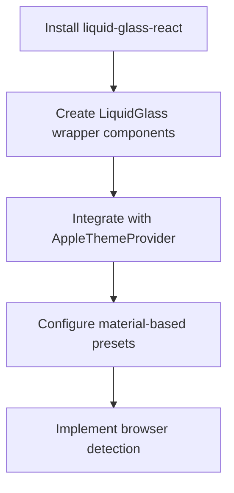
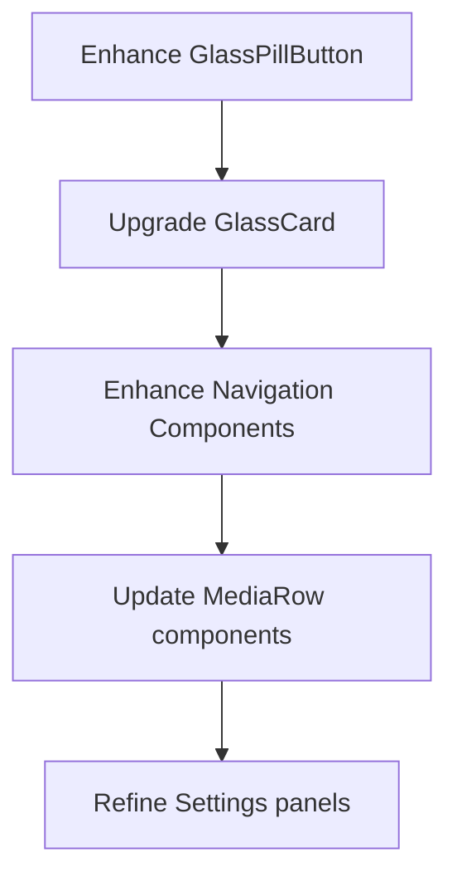
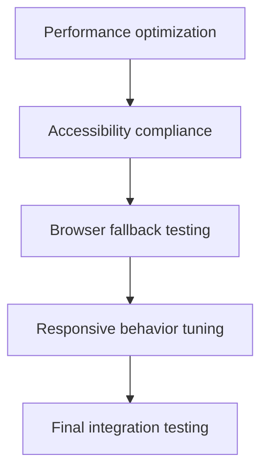
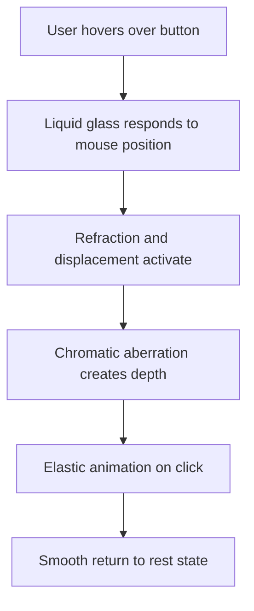
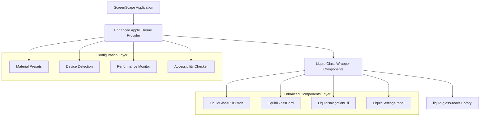

# Liquid Glass React Integration Specification

## 1. Product Overview

This specification outlines the integration of the liquid-glass-react library into the ScreenScape application to enhance the existing Apple design system with authentic liquid glass physics and visual effects. The integration will add proper edgy bending, refraction, configurable elasticity, and chromatic aberration while maintaining the current frosted glass aesthetic and performance standards.

The liquid-glass-react library provides Apple's authentic liquid glass effect with multiple refraction modes, configurable frosty levels, and proper hover/click effects that respond to underlying light, creating a more immersive and premium user experience.

## 2. Core Features

### 2.1 Integration Strategy

The liquid-glass-react library will be integrated as an enhancement layer over the existing Apple design system components, preserving the current component API while adding advanced visual effects.

**Integration Approach:**
- **Wrapper Pattern**: Create enhanced versions of existing components that wrap content with LiquidGlass
- **Progressive Enhancement**: Maintain fallbacks for browsers with limited support (Safari/Firefox)
- **Configuration Inheritance**: Use existing material tokens to configure liquid glass properties
- **Performance First**: Implement selective rendering based on device capabilities

### 2.2 Component Enhancement Plan

**Priority 1 - Core Interactive Components:**
1. **GlassPillButton** - Enhanced with liquid elasticity and refraction
2. **GlassCard** - Media cards with prominent liquid glass effects
3. **TopNavigation** - Navigation pills with subtle liquid effects
4. **PillNavigation** - Tab switching with liquid transitions

**Priority 2 - Content Components:**
1. **MediaRow** - Movie/show cards with hover liquid effects
2. **Settings** - Settings panels with refined glass materials
3. **HeroCarousel** - Hero sections with prominent liquid backgrounds
4. **QuickJump** - Search and quick access with liquid responsiveness

**Priority 3 - Specialized Components:**
1. **AIAssistant** - Chat interface with liquid glass panels
2. **GameView** - Game interfaces with dynamic liquid effects
3. **LiveView** - Live content with subtle liquid backgrounds
4. **MediaDetail** - Detail views with immersive liquid glass

### 2.3 Liquid Glass Configuration Matrix

| Component Type | Displacement Scale | Blur Amount | Saturation | Aberration | Elasticity | Corner Radius | Mode |
|----------------|-------------------|-------------|------------|------------|------------|---------------|------|
| **Buttons** | 45-65 | 0.08-0.12 | 120-140 | 1.5-2.5 | 0.25-0.35 | 100-999 | standard |
| **Cards** | 60-80 | 0.06-0.10 | 130-150 | 2-3 | 0.15-0.25 | 12-24 | prominent |
| **Navigation** | 35-50 | 0.10-0.15 | 110-130 | 1-2 | 0.20-0.30 | 999 | standard |
| **Panels** | 70-90 | 0.05-0.08 | 140-160 | 2.5-3.5 | 0.10-0.20 | 16-32 | polar |
| **Hero Elements** | 80-100 | 0.04-0.07 | 150-170 | 3-4 | 0.05-0.15 | 24-48 | shader |

## 3. Core Process

### 3.1 Implementation Flow

**Phase 1: Foundation Setup**


**Phase 2: Component Enhancement**


**Phase 3: Optimization & Polish**


### 3.2 User Interaction Flow

**Enhanced Button Interaction:**


## 4. User Interface Design

### 4.1 Design Style Enhancement

**Liquid Glass Material Properties:**
- **Primary Colors**: Maintain existing Apple system colors with enhanced refraction
- **Refraction Modes**: 
  - Standard: General UI elements
  - Polar: Circular navigation elements
  - Prominent: Hero sections and featured content
  - Shader: High-impact areas (with performance considerations)
- **Animation Timing**: Inherit from existing Apple animation tokens
- **Elasticity Levels**: 
  - Subtle (0.05-0.15): Background elements
  - Medium (0.15-0.25): Interactive cards
  - Prominent (0.25-0.35): Primary buttons and CTAs

### 4.2 Component Design Specifications

| Component | Liquid Glass Properties | Visual Behavior |
|-----------|------------------------|-----------------|
| **Enhanced GlassPillButton** | Elasticity: 0.3, Displacement: 55, Blur: 0.1 | Liquid deformation on hover, elastic click response |
| **Liquid GlassCard** | Elasticity: 0.2, Displacement: 70, Mode: prominent | Subtle refraction, enhanced depth on interaction |
| **Navigation Pills** | Elasticity: 0.25, Displacement: 40, Corner: 999 | Smooth liquid transitions between states |
| **Settings Panels** | Elasticity: 0.15, Displacement: 75, Mode: polar | Refined glass with circular refraction patterns |
| **Media Cards** | Elasticity: 0.18, Displacement: 65, Aberration: 2.5 | Dynamic refraction responding to content imagery |

### 4.3 Responsiveness

**Desktop (>1024px):**
- Full liquid glass effects with all refraction modes
- Mouse container support for large interaction areas
- High displacement scales and aberration intensity

**Tablet (768px-1024px):**
- Reduced displacement scales (70% of desktop values)
- Standard and polar modes only
- Optimized elasticity for touch interactions

**Mobile (<768px):**
- Minimal liquid effects (50% of desktop values)
- Standard mode only with reduced aberration
- Touch-optimized elasticity values
- Automatic fallback to static glass on low-performance devices

## 5. Technical Architecture

### 5.1 Architecture Design



### 5.2 Technology Stack

- **Frontend**: React@19 + liquid-glass-react@1.1.1 + styled-components@6.1.19
- **Design System**: Enhanced AppleThemeProvider with liquid glass material tokens
- **Performance**: Intersection Observer API for selective rendering
- **Accessibility**: Respects prefers-reduced-motion and prefers-reduced-transparency

### 5.3 Component API Design

**Enhanced GlassPillButton:**
```typescript
interface LiquidGlassPillButtonProps extends GlassPillButtonProps {
  liquidIntensity?: 'subtle' | 'medium' | 'prominent';
  refractionMode?: 'standard' | 'polar' | 'prominent' | 'shader';
  enableLiquidEffects?: boolean;
  mouseContainer?: React.RefObject<HTMLElement>;
}
```

**Liquid Glass Configuration:**
```typescript
interface LiquidGlassConfig {
  displacementScale: number;
  blurAmount: number;
  saturation: number;
  aberrationIntensity: number;
  elasticity: number;
  cornerRadius: number;
  mode: 'standard' | 'polar' | 'prominent' | 'shader';
}
```

## 6. Implementation Phases

### 6.1 Phase 1: Foundation (Week 1)

**Core Setup:**
- Install and configure liquid-glass-react
- Create base LiquidGlass wrapper component
- Integrate with existing AppleThemeProvider
- Implement device capability detection
- Create material preset configurations

**Deliverables:**
- `LiquidGlassWrapper.tsx` - Base wrapper component
- Enhanced `AppleThemeProvider.tsx` with liquid glass tokens
- `liquidGlassPresets.ts` - Configuration presets
- `deviceCapabilities.ts` - Performance detection utility

### 6.2 Phase 2: Core Components (Week 2)

**Component Enhancement:**
- Upgrade GlassPillButton with liquid effects
- Enhance GlassCard with refraction modes
- Update TopNavigation and PillNavigation
- Implement mouse container support

**Deliverables:**
- `LiquidGlassPillButton.tsx` - Enhanced button component
- `LiquidGlassCard.tsx` - Enhanced card component
- `LiquidNavigationPill.tsx` - Enhanced navigation
- Performance benchmarking results

### 6.3 Phase 3: Content Components (Week 3)

**Content Enhancement:**
- Upgrade MediaRow with hover liquid effects
- Enhance Settings panels with refined materials
- Update HeroCarousel with prominent effects
- Implement QuickJump liquid responsiveness

**Deliverables:**
- Enhanced MediaRow, Settings, HeroCarousel components
- Responsive behavior implementations
- Accessibility compliance testing
- Browser compatibility validation

### 6.4 Phase 4: Optimization & Polish (Week 4)

**Final Integration:**
- Performance optimization and selective rendering
- Accessibility enhancements and user preference respect
- Browser fallback implementations
- Comprehensive testing and documentation

**Deliverables:**
- Performance-optimized components
- Complete accessibility compliance
- Browser fallback strategies
- Integration documentation and examples

## 7. Performance Considerations

### 7.1 Selective Rendering Strategy

**Device-Based Rendering:**
- High-end devices: Full liquid glass effects with shader mode
- Mid-range devices: Standard and polar modes only
- Low-end devices: Fallback to existing frosted glass
- Mobile devices: Reduced effect intensity and limited modes

**Intersection Observer Implementation:**
- Only render liquid effects for visible components
- Lazy load liquid glass for off-screen elements
- Automatic cleanup for unmounted components

### 7.2 Browser Compatibility

**Full Support (Chrome, Edge):**
- All refraction modes available
- Full displacement and aberration effects
- Complete mouse interaction support

**Partial Support (Safari, Firefox):**
- Limited displacement visibility
- Fallback to enhanced blur and saturation
- Maintain elasticity and basic refraction

**Fallback Strategy:**
- Graceful degradation to existing frosted glass
- Maintain component functionality without liquid effects
- User preference detection and respect

## 8. Accessibility Compliance

### 8.1 User Preference Respect

**Reduced Motion:**
```css
@media (prefers-reduced-motion: reduce) {
  /* Disable elasticity and displacement animations */
  .liquid-glass-component {
    --elasticity: 0;
    --displacement-scale: 0;
    transition: none;
  }
}
```

**Reduced Transparency:**
```css
@media (prefers-reduced-transparency: reduce) {
  /* Fallback to solid backgrounds */
  .liquid-glass-component {
    background: var(--apple-background-primary);
    backdrop-filter: none;
  }
}
```

### 8.2 Keyboard Navigation

- Maintain focus indicators with liquid glass effects
- Ensure keyboard navigation works with enhanced components
- Provide clear focus states that work with refraction effects

## 9. Testing Strategy

### 9.1 Performance Testing

- Frame rate monitoring during liquid glass interactions
- Memory usage tracking for complex refraction modes
- Battery impact assessment on mobile devices
- Load time impact measurement

### 9.2 Visual Regression Testing

- Component appearance across different browsers
- Fallback behavior validation
- Responsive design consistency
- Accessibility compliance verification

### 9.3 User Experience Testing

- Interaction responsiveness with liquid effects
- Visual hierarchy maintenance with enhanced materials
- Cross-device experience consistency
- User preference respect validation

## 10. Success Metrics

### 10.1 Performance Metrics

- **Frame Rate**: Maintain 60fps during liquid glass interactions
- **Load Time**: <5% increase in initial component render time
- **Memory Usage**: <10% increase in peak memory consumption
- **Battery Impact**: Minimal impact on mobile device battery life

### 10.2 User Experience Metrics

- **Visual Appeal**: Enhanced perceived quality and premium feel
- **Interaction Responsiveness**: Smooth, elastic interactions
- **Accessibility**: 100% compliance with WCAG guidelines
- **Browser Compatibility**: Graceful degradation across all supported browsers

This specification provides a comprehensive roadmap for integrating liquid-glass-react into ScreenScape while maintaining performance, accessibility, and the existing Apple design language.