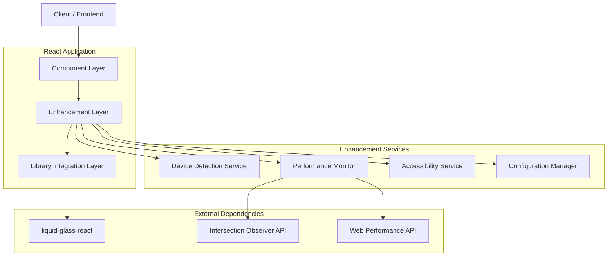
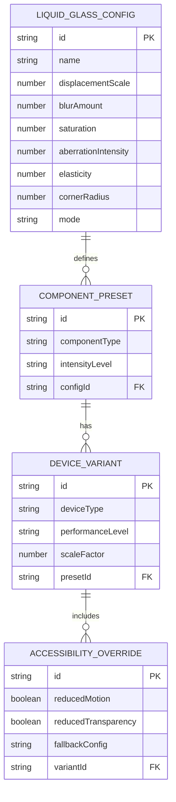

# Liquid Glass React - Technical Architecture Document

## 1. Architecture Design

```mermaid
graph TD
    A[User Browser] --> B[ScreenScape React Application]
    B --> C[Enhanced Apple Theme Provider]
    C --> D[Liquid Glass Wrapper Components]
    D --> E[liquid-glass-react Library]
    
    F[Device Capability Detection] --> C
    G[Performance Monitor] --> D
    H[Accessibility Checker] --> D
    
    subgraph "Frontend Layer"
        B
        C
        D
    end
    
    subgraph "Enhancement Layer"
        E
        F
        G
        H
    end
    
    subgraph "External Library"
        I[liquid-glass-react@1.1.1]
    end
    
    E --> I
```

## 2. Technology Description

- **Frontend**: React@19 + liquid-glass-react@1.1.1 + styled-components@6.1.19 + framer-motion@12.23.24
- **Design System**: Enhanced AppleThemeProvider with liquid glass material tokens
- **Performance**: Intersection Observer API + Device Capability Detection
- **Accessibility**: WCAG 2.1 AA compliance with user preference detection

## 3. Route Definitions

| Route | Purpose | Liquid Glass Enhancement |
|-------|---------|-------------------------|
| / | Home page with hero carousel and media rows | Prominent liquid glass on hero, subtle on media cards |
| /live | Live channels with streaming content | Medium liquid effects on channel cards |
| /likes | User's liked content and preferences | Standard liquid glass on content cards |
| /games | Interactive games and entertainment | Dynamic liquid effects responding to game state |
| /settings | Application settings and preferences | Refined liquid glass panels with polar refraction |

## 4. API Definitions

### 4.1 Core Liquid Glass API

**Liquid Glass Wrapper Component**
```typescript
interface LiquidGlassWrapperProps {
  children: React.ReactNode;
  intensity?: 'subtle' | 'medium' | 'prominent';
  mode?: 'standard' | 'polar' | 'prominent' | 'shader';
  enableEffects?: boolean;
  mouseContainer?: React.RefObject<HTMLElement>;
  className?: string;
  style?: React.CSSProperties;
}
```

**Enhanced Apple Theme Provider**
```typescript
interface LiquidGlassTokens {
  presets: {
    subtle: LiquidGlassConfig;
    medium: LiquidGlassConfig;
    prominent: LiquidGlassConfig;
  };
  modes: {
    standard: ModeConfig;
    polar: ModeConfig;
    prominent: ModeConfig;
    shader: ModeConfig;
  };
}

interface LiquidGlassConfig {
  displacementScale: number;
  blurAmount: number;
  saturation: number;
  aberrationIntensity: number;
  elasticity: number;
  cornerRadius: number;
}
```

### 4.2 Component Enhancement APIs

**Enhanced GlassPillButton**
```typescript
interface LiquidGlassPillButtonProps extends GlassPillButtonProps {
  liquidIntensity?: 'subtle' | 'medium' | 'prominent';
  refractionMode?: 'standard' | 'polar' | 'prominent' | 'shader';
  enableLiquidEffects?: boolean;
  elasticResponse?: boolean;
}
```

**Enhanced GlassCard**
```typescript
interface LiquidGlassCardProps extends GlassCardProps {
  liquidIntensity?: 'subtle' | 'medium' | 'prominent';
  refractionMode?: 'standard' | 'polar' | 'prominent' | 'shader';
  mouseContainer?: React.RefObject<HTMLElement>;
  chromaticAberration?: number;
}
```

### 4.3 Device Capability Detection API

**Device Capabilities Service**
```typescript
interface DeviceCapabilities {
  supportsBackdropFilter: boolean;
  supportsWebGL: boolean;
  performanceLevel: 'low' | 'medium' | 'high';
  prefersReducedMotion: boolean;
  prefersReducedTransparency: boolean;
  isMobile: boolean;
  browserSupport: 'full' | 'partial' | 'none';
}

// Usage Example
const capabilities = useDeviceCapabilities();
const shouldUseLiquidGlass = capabilities.performanceLevel !== 'low' && 
                            capabilities.browserSupport !== 'none';
```

## 5. Server Architecture Diagram



## 6. Data Model

### 6.1 Liquid Glass Configuration Model



### 6.2 Data Definition Language

**Liquid Glass Configuration Store**
```typescript
// Configuration presets for different component types and intensities
const liquidGlassPresets = {
  button: {
    subtle: {
      displacementScale: 35,
      blurAmount: 0.12,
      saturation: 120,
      aberrationIntensity: 1.5,
      elasticity: 0.20,
      cornerRadius: 100,
      mode: 'standard'
    },
    medium: {
      displacementScale: 50,
      blurAmount: 0.10,
      saturation: 130,
      aberrationIntensity: 2.0,
      elasticity: 0.28,
      cornerRadius: 100,
      mode: 'standard'
    },
    prominent: {
      displacementScale: 65,
      blurAmount: 0.08,
      saturation: 140,
      aberrationIntensity: 2.5,
      elasticity: 0.35,
      cornerRadius: 100,
      mode: 'prominent'
    }
  },
  card: {
    subtle: {
      displacementScale: 45,
      blurAmount: 0.08,
      saturation: 130,
      aberrationIntensity: 2.0,
      elasticity: 0.15,
      cornerRadius: 16,
      mode: 'standard'
    },
    medium: {
      displacementScale: 65,
      blurAmount: 0.07,
      saturation: 140,
      aberrationIntensity: 2.5,
      elasticity: 0.20,
      cornerRadius: 20,
      mode: 'polar'
    },
    prominent: {
      displacementScale: 80,
      blurAmount: 0.06,
      saturation: 150,
      aberrationIntensity: 3.0,
      elasticity: 0.25,
      cornerRadius: 24,
      mode: 'prominent'
    }
  },
  navigation: {
    subtle: {
      displacementScale: 30,
      blurAmount: 0.15,
      saturation: 110,
      aberrationIntensity: 1.0,
      elasticity: 0.20,
      cornerRadius: 999,
      mode: 'standard'
    },
    medium: {
      displacementScale: 40,
      blurAmount: 0.12,
      saturation: 120,
      aberrationIntensity: 1.5,
      elasticity: 0.25,
      cornerRadius: 999,
      mode: 'standard'
    },
    prominent: {
      displacementScale: 50,
      blurAmount: 0.10,
      saturation: 130,
      aberrationIntensity: 2.0,
      elasticity: 0.30,
      cornerRadius: 999,
      mode: 'polar'
    }
  },
  panel: {
    subtle: {
      displacementScale: 55,
      blurAmount: 0.06,
      saturation: 140,
      aberrationIntensity: 2.5,
      elasticity: 0.10,
      cornerRadius: 24,
      mode: 'polar'
    },
    medium: {
      displacementScale: 70,
      blurAmount: 0.05,
      saturation: 150,
      aberrationIntensity: 3.0,
      elasticity: 0.15,
      cornerRadius: 28,
      mode: 'polar'
    },
    prominent: {
      displacementScale: 90,
      blurAmount: 0.04,
      saturation: 160,
      aberrationIntensity: 3.5,
      elasticity: 0.20,
      cornerRadius: 32,
      mode: 'shader'
    }
  }
};

// Device-specific scaling factors
const deviceScaling = {
  mobile: {
    low: 0.3,
    medium: 0.5,
    high: 0.7
  },
  tablet: {
    low: 0.5,
    medium: 0.7,
    high: 0.8
  },
  desktop: {
    low: 0.7,
    medium: 0.9,
    high: 1.0
  }
};

// Accessibility overrides
const accessibilityOverrides = {
  reducedMotion: {
    elasticity: 0,
    displacementScale: 0,
    aberrationIntensity: 0
  },
  reducedTransparency: {
    blurAmount: 0,
    saturation: 100,
    mode: 'standard'
  }
};
```

**Component Integration Examples**
```typescript
// Enhanced GlassPillButton implementation
import LiquidGlass from 'liquid-glass-react';
import { useAppleTheme } from './AppleThemeProvider';
import { useDeviceCapabilities } from './hooks/useDeviceCapabilities';

const LiquidGlassPillButton: React.FC<LiquidGlassPillButtonProps> = ({
  children,
  liquidIntensity = 'medium',
  refractionMode,
  enableLiquidEffects = true,
  ...props
}) => {
  const { tokens } = useAppleTheme();
  const capabilities = useDeviceCapabilities();
  
  const config = tokens.liquidGlass.presets.button[liquidIntensity];
  const shouldUseLiquidGlass = enableLiquidEffects && 
                              capabilities.performanceLevel !== 'low' &&
                              capabilities.browserSupport !== 'none';
  
  if (!shouldUseLiquidGlass) {
    return <GlassPillButton {...props}>{children}</GlassPillButton>;
  }
  
  return (
    <LiquidGlass
      displacementScale={config.displacementScale * capabilities.scaleFactor}
      blurAmount={config.blurAmount}
      saturation={config.saturation}
      aberrationIntensity={config.aberrationIntensity}
      elasticity={config.elasticity}
      cornerRadius={config.cornerRadius}
      mode={refractionMode || config.mode}
      onClick={props.onClick}
      className={props.className}
      style={props.style}
    >
      <GlassPillButtonContent {...props}>
        {children}
      </GlassPillButtonContent>
    </LiquidGlass>
  );
};

// Enhanced GlassCard implementation
const LiquidGlassCard: React.FC<LiquidGlassCardProps> = ({
  children,
  liquidIntensity = 'medium',
  mouseContainer,
  ...props
}) => {
  const { tokens } = useAppleTheme();
  const capabilities = useDeviceCapabilities();
  
  const config = tokens.liquidGlass.presets.card[liquidIntensity];
  const shouldUseLiquidGlass = capabilities.performanceLevel !== 'low';
  
  if (!shouldUseLiquidGlass) {
    return <GlassCard {...props}>{children}</GlassCard>;
  }
  
  return (
    <LiquidGlass
      displacementScale={config.displacementScale * capabilities.scaleFactor}
      blurAmount={config.blurAmount}
      saturation={config.saturation}
      aberrationIntensity={config.aberrationIntensity}
      elasticity={config.elasticity}
      cornerRadius={config.cornerRadius}
      mode={config.mode}
      mouseContainer={mouseContainer}
      onClick={props.onClick}
    >
      <GlassCardContent {...props}>
        {children}
      </GlassCardContent>
    </LiquidGlass>
  );
};
```

This technical architecture provides a comprehensive foundation for integrating liquid-glass-react into the ScreenScape application while maintaining performance, accessibility, and the existing Apple design language.