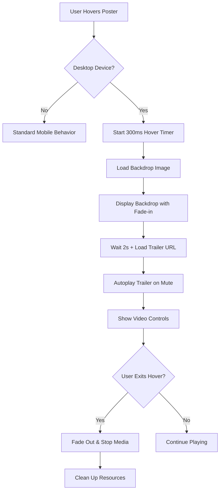

# Poster Hover Backdrop & Trailer Feature Specification

## 1. Product Overview

This feature enhances the desktop user experience by displaying movie/TV show backdrops and autoplaying trailers when users hover over poster images. The feature creates an immersive preview experience that helps users make informed viewing decisions without leaving the current page.

- **Primary Purpose**: Provide rich media previews on hover to enhance content discovery and user engagement
- **Target Users**: Desktop users browsing movie/TV show collections in MediaRow components
- **Value Proposition**: Reduces clicks needed to preview content while maintaining elegant, non-intrusive design

## 2. Core Features

### 2.1 User Roles
This feature applies to all users on desktop devices - no role distinction is necessary.

### 2.2 Feature Module
The poster hover enhancement consists of the following components:
1. **Enhanced MediaCard Component**: Updated poster cards with hover detection and media loading
2. **Backdrop Overlay System**: Dynamic backdrop image display with smooth transitions
3. **Trailer Player Component**: Muted autoplay video player with controls
4. **Media Preloader Service**: Efficient loading and caching of backdrop images and trailer URLs
5. **Device Detection Integration**: Desktop-only activation with mobile fallback prevention

### 2.3 Page Details

| Component Name | Module Name | Feature Description |
|----------------|-------------|---------------------|
| Enhanced MediaCard | Hover Detection | Detect mouse enter/leave events, implement hover delay (300ms) to prevent accidental triggers, track hover state for smooth transitions |
| Enhanced MediaCard | Media Loading | Fetch backdrop images and trailer URLs on hover, implement loading states, handle API failures gracefully |
| Backdrop Overlay | Image Display | Show high-resolution backdrop as background overlay, apply blur and opacity effects for depth, maintain aspect ratio and responsive sizing |
| Backdrop Overlay | Transition Effects | Smooth fade-in/out animations (400ms), scale and blur transitions, maintain liquid glass aesthetic with backdrop filters |
| Trailer Player | Video Autoplay | Autoplay trailer video on mute, implement 2-second delay after backdrop appears, show loading spinner during video buffering |
| Trailer Player | Controls & Accessibility | Provide mute/unmute toggle, pause/play controls on click, respect user's motion preferences, include keyboard navigation |
| Media Preloader | Caching Strategy | Cache backdrop images and trailer URLs, implement LRU cache with 50-item limit, preload on component mount for popular items |
| Media Preloader | Performance Optimization | Lazy load media assets, implement request debouncing, cancel requests on hover exit, optimize for bandwidth usage |

## 3. Core Process

**Desktop User Hover Flow:**
1. User hovers over a movie/TV show poster in MediaRow
2. System detects desktop device and initiates hover sequence
3. After 300ms hover delay, backdrop image begins loading
4. Backdrop fades in with blur effect behind the poster
5. After backdrop loads (2s delay), trailer URL is fetched
6. Trailer begins autoplaying on mute with smooth fade-in
7. User can interact with video controls or continue browsing
8. On hover exit, all media stops and overlay fades out

**Mobile User Flow:**
1. User taps poster on mobile device
2. System detects mobile and skips hover effects
3. Standard poster click behavior is maintained
4. No backdrop or trailer loading occurs

## 4. User Interface Design

### 4.1 Design Style
- **Primary Colors**: Maintain existing liquid glass theme with `rgba(255, 255, 255, 0.1)` overlays
- **Backdrop Effects**: Use `backdrop-filter: blur(20px)` for depth, apply `opacity: 0.8` for backdrop images
- **Animation Style**: Smooth CSS transitions with `ease-out` timing, 400ms duration for overlays
- **Typography**: Existing Apple theme typography for any overlay text elements
- **Video Player**: Minimal controls with liquid glass styling, rounded corners matching design system

### 4.2 Page Design Overview

| Component | Module | UI Elements |
|-----------|--------|-------------|
| Enhanced MediaCard | Hover Container | Maintain existing poster styling, add `overflow: visible` for backdrop expansion, implement `z-index` layering for proper stacking |
| Backdrop Overlay | Background Layer | Position absolute backdrop 20px beyond poster bounds, apply `border-radius: 16px` matching poster, use `box-shadow: 0 20px 40px rgba(0,0,0,0.3)` for depth |
| Trailer Player | Video Element | 16:9 aspect ratio video player, positioned below backdrop, liquid glass controls with 80% opacity, mute/unmute icon in bottom-right |
| Loading States | Progress Indicators | Subtle shimmer effect for backdrop loading, spinning loader for video buffering, fade-in animations for smooth transitions |

### 4.3 Responsiveness
- **Desktop-First**: Feature activates only on devices with hover capability
- **Breakpoint Handling**: Disable on screens smaller than 1024px width
- **Touch Device Detection**: Use `@media (hover: hover)` CSS query for hover-capable devices
- **Performance Scaling**: Reduce backdrop quality on lower-end devices, implement connection-aware loading