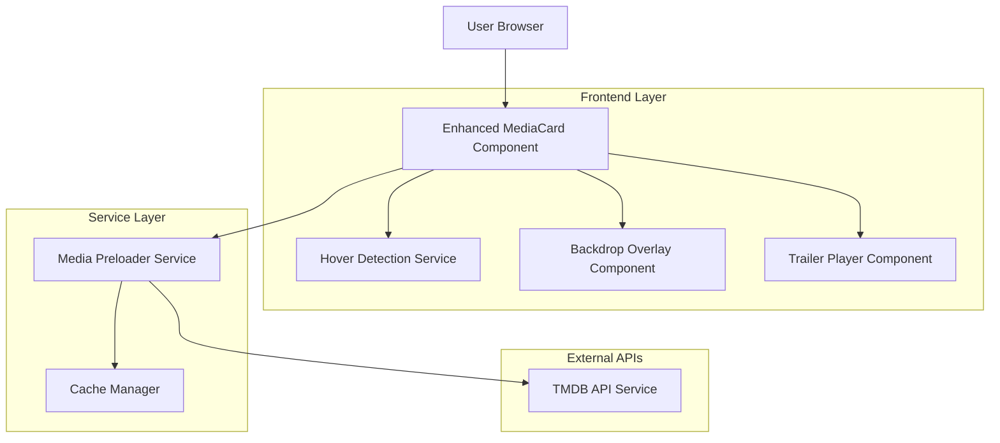
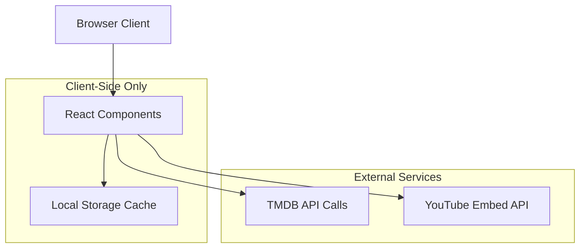

# Poster Hover Feature Technical Architecture

## 1. Architecture Design



## 2. Technology Description

- Frontend: React@18 + TypeScript + Framer Motion + tailwindcss@3 + vite
- Backend: None (client-side only feature)
- APIs: TMDB API (existing integration)
- Caching: Browser localStorage + in-memory LRU cache
- Device Detection: CSS @media queries + JavaScript hover capability detection

## 3. Route Definitions

This feature enhances existing routes without adding new ones:

| Route | Enhancement |
|-------|-------------|
| /home | Enhanced MediaRow components with hover functionality |
| /netflix | Enhanced provider-specific MediaRow components |
| /search | Enhanced search result MediaCard components |
| /provider/* | Enhanced MediaRow components across all provider views |

## 4. API Definitions

### 4.1 Enhanced TMDB Service Functions

**Backdrop Image Fetching**
```typescript
// Enhanced existing function
getMovieImages(apiKey: string, movieId: number): Promise<BackdropResponse>
getTVShowImages(apiKey: string, tvId: number): Promise<BackdropResponse>
```

**Trailer Video Fetching**
```typescript
// Enhanced existing function  
getMovieVideos(apiKey: string, movieId: number): Promise<VideoResponse>
getTVShowVideos(apiKey: string, tvId: number): Promise<VideoResponse>
```

**New Hover-Specific Service**
```typescript
interface HoverMediaData {
  backdropUrl: string | null;
  trailerUrl: string | null;
  trailerKey: string | null;
}

class MediaHoverService {
  async getHoverMedia(item: MediaItem, apiKey: string): Promise<HoverMediaData>
  async preloadBackdrop(url: string): Promise<void>
  async getYouTubeEmbedUrl(videoKey: string): Promise<string>
}
```

### 4.2 Component Props Interface

**Enhanced MediaCard Props**
```typescript
interface EnhancedMediaCardProps {
  item: MediaItem;
  onSelectItem: (item: MediaItem) => void;
  apiKey: string;
  enableHover?: boolean; // Default: true on desktop
  hoverDelay?: number;   // Default: 300ms
  trailerDelay?: number; // Default: 2000ms
}
```

**Backdrop Overlay Props**
```typescript
interface BackdropOverlayProps {
  backdropUrl: string;
  isVisible: boolean;
  onLoad: () => void;
  onError: () => void;
}
```

**Trailer Player Props**
```typescript
interface TrailerPlayerProps {
  trailerUrl: string;
  isVisible: boolean;
  autoplay: boolean;
  muted: boolean;
  onLoadStart: () => void;
  onCanPlay: () => void;
  onError: () => void;
}
```

## 5. Server Architecture Diagram

This feature is entirely client-side, no server architecture required.



## 6. Data Model

### 6.1 Cache Data Structure

```typescript
interface CachedMediaData {
  id: string; // `${mediaType}-${itemId}`
  backdropUrl: string | null;
  trailerKey: string | null;
  trailerUrl: string | null;
  timestamp: number;
  expiresAt: number; // 24 hours from cache
}

interface HoverCache {
  data: Map<string, CachedMediaData>;
  maxSize: number; // 50 items
  cleanup(): void;
  get(key: string): CachedMediaData | null;
  set(key: string, data: CachedMediaData): void;
}
```

### 6.2 Component State Management

```typescript
interface MediaCardHoverState {
  isHovering: boolean;
  hoverTimer: NodeJS.Timeout | null;
  trailerTimer: NodeJS.Timeout | null;
  backdropLoaded: boolean;
  trailerLoaded: boolean;
  mediaData: HoverMediaData | null;
  error: string | null;
}

interface BackdropOverlayState {
  imageLoaded: boolean;
  imageError: boolean;
  opacity: number;
}

interface TrailerPlayerState {
  videoLoaded: boolean;
  videoError: boolean;
  isPlaying: boolean;
  isMuted: boolean;
  showControls: boolean;
}
```

### 6.3 Performance Monitoring

```typescript
interface HoverPerformanceMetrics {
  backdropLoadTime: number;
  trailerLoadTime: number;
  cacheHitRate: number;
  errorRate: number;
  userEngagement: {
    hoverDuration: number;
    trailerWatchTime: number;
    clickThroughRate: number;
  };
}
```

## 7. Implementation Strategy

### 7.1 Phase 1: Core Infrastructure
- Enhance MediaCard component with hover detection
- Implement MediaHoverService for API calls
- Create cache management system
- Add device detection utilities

### 7.2 Phase 2: Backdrop Display
- Create BackdropOverlay component
- Implement smooth transition animations
- Add loading states and error handling
- Integrate with existing liquid glass design

### 7.3 Phase 3: Trailer Integration
- Create TrailerPlayer component
- Implement YouTube embed functionality
- Add video controls and accessibility features
- Optimize for performance and bandwidth

### 7.4 Phase 4: Optimization & Polish
- Implement advanced caching strategies
- Add performance monitoring
- Conduct accessibility testing
- Fine-tune animations and transitions

## 8. Performance Considerations

### 8.1 Loading Strategy
- **Lazy Loading**: Only load media on hover initiation
- **Request Debouncing**: Cancel previous requests on rapid hover changes
- **Connection Awareness**: Reduce quality on slow connections
- **Preloading**: Cache popular items during idle time

### 8.2 Memory Management
- **LRU Cache**: Limit cache to 50 items with automatic cleanup
- **Image Cleanup**: Remove blob URLs when components unmount
- **Video Cleanup**: Properly dispose of video elements
- **Timer Cleanup**: Clear all timers on component unmount

### 8.3 Bandwidth Optimization
- **Backdrop Quality**: Use w780 images instead of original
- **Video Quality**: Default to 480p for autoplay trailers
- **Compression**: Implement WebP support for backdrops
- **CDN Usage**: Leverage TMDB's CDN for optimal delivery