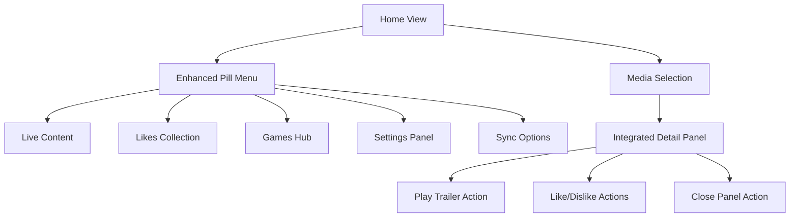
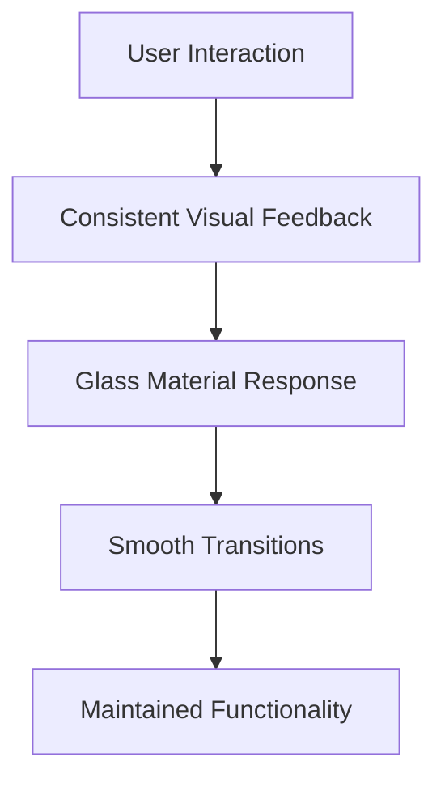

# ScreenScape 2.0 UI Redesign Specification

## 1. Project Overview

This document outlines a comprehensive UI redesign for ScreenScape 2.0 focused on creating a cohesive and sleek appearance across all interactive elements. The redesign emphasizes visual consistency, improved user experience, and seamless integration of existing functionality with enhanced material design principles.

The primary goal is to establish a unified design language that maintains the existing liquid glass aesthetic while improving visual hierarchy, interaction patterns, and overall user interface cohesion.

## 2. Core Features

### 2.1 Design System Unification
Our redesign focuses on creating visual consistency across all UI components by standardizing:
- Material design properties (glass effects, transparency, blur)
- Interactive element styling (buttons, navigation, controls)
- Typography and spacing systems
- Color schemes and hover states
- Animation and transition patterns

### 2.2 Feature Module

The UI redesign encompasses the following main component areas:
1. **Navigation System**: Enhanced pill menu with refined styling and improved accessibility
2. **Content Display**: Integrated title pages with panel-based layout system
3. **Interactive Controls**: Standardized button styling across all user actions
4. **Media Presentation**: Logo-based title display with intelligent fallback systems
5. **Modal Controls**: Enhanced close buttons and overlay interactions

### 2.3 Component Details

| Component Area | Module Name | Feature Description |
|----------------|-------------|---------------------|
| Navigation System | Pill Menu Enhancement | Update "Live Channels" to "Live", implement 50% border radius for full pill appearance, maintain consistent padding and spacing |
| Navigation System | Visual Consistency | Apply uniform glass material effects, standardize hover states and active indicators |
| Content Display | Title Page Integration | Convert MediaDetail modal into integrated panel component within home layout |
| Content Display | Responsive Behavior | Implement smooth transitions, maintain functionality across screen sizes |
| Interactive Controls | Play Trailer Button | Match pill menu styling with semi-transparent background, identical color scheme and hover effects |
| Interactive Controls | Like/Dislike Buttons | Apply consistent material design, uniform icon sizing and padding |
| Interactive Controls | Button Standardization | Ensure all interactive elements share visual language and accessibility standards |
| Media Presentation | Logo Display System | Replace text-based titles with TMDB logos, implement aspect ratio maintenance |
| Media Presentation | Fallback Mechanism | Provide graceful degradation to text display for missing logos |
| Modal Controls | Close Button Enhancement | Apply matching material design, ensure proper touch targets and accessibility |
| Modal Controls | Visual Integration | Maintain consistency with other interactive elements using glass effects |

## 3. Core Process

### User Interaction Flow
Users navigate through the application using the enhanced pill menu system, which provides immediate visual feedback and consistent interaction patterns. When selecting media content, the integrated panel system displays detailed information without disrupting the main interface flow.

**Primary Navigation Flow:**

**Enhanced Interaction Flow:**

## 4. User Interface Design

### 4.1 Design Style

**Core Visual Elements:**
- **Primary Colors**: Maintain existing Apple-inspired color palette with enhanced glass transparency
- **Secondary Colors**: Refined accent colors for active states and interactive feedback
- **Button Style**: Full pill appearance with 50% border radius, semi-transparent glass backgrounds
- **Typography**: Consistent SF Pro font family with improved hierarchy
- **Layout Style**: Integrated panel-based design with seamless transitions
- **Glass Effects**: Enhanced liquid glass materials with consistent blur and opacity values
- **Icon Style**: Uniform sizing (20px standard) with consistent stroke weights
- **Animation**: Smooth cubic-bezier transitions (0.2s duration) for all interactive elements

### 4.2 Component Design Specifications

| Component | Visual Properties | Interaction States |
|-----------|------------------|-------------------|
| Pill Menu Container | 50% border radius, ultra-transparent glass background, 64px min height | Hover: subtle glow, Active: enhanced shadow |
| Navigation Items | Full pill shape, consistent 12px padding, white icons on active | Hover: scale 1.05, Active: gradient background |
| Play Trailer Button | Matching pill styling, red gradient for active state, centered layout | Hover: enhanced glow, Press: scale 0.95 |
| Like/Dislike Buttons | Pill-shaped, green/red gradients for active states, consistent spacing | Hover: color intensity, Active: filled icons |
| Close Button | Circular pill (1:1 ratio), glass background, proper touch target (44px min) | Hover: background opacity, Press: scale feedback |
| Title Display | Logo-first approach, responsive scaling, text fallback with consistent typography | Hover: subtle highlight, Focus: accessibility outline |

### 4.3 Material Design System

**Glass Material Properties:**
- **Ultra Thin**: 2% opacity, 8px blur, minimal shadow
- **Thin**: 4% opacity, 12px blur, subtle shadow
- **Regular**: 6% opacity, 16px blur, medium shadow
- **Thick**: 8% opacity, 20px blur, prominent shadow
- **Prominent**: 10% opacity, 24px blur, enhanced shadow

**Interactive Element Standards:**
- **Border Radius**: 50% for pill shapes, maintaining aspect ratios
- **Padding**: Consistent 12px horizontal, 8px vertical for buttons
- **Icon Size**: 20px standard, 24px for primary actions
- **Touch Targets**: Minimum 44px for accessibility compliance
- **Transitions**: 0.2s cubic-bezier(0.4, 0, 0.2, 1) for all animations

### 4.4 Responsiveness

**Design Approach:**
- **Desktop-First**: Optimized for larger screens with full feature set
- **Mobile-Adaptive**: Responsive scaling with touch-optimized interactions
- **Cross-Platform**: Consistent rendering across browsers and devices
- **Accessibility**: Full keyboard navigation and screen reader support
- **Performance**: Optimized animations with reduced motion preferences

**Breakpoint Strategy:**
- **Large Desktop**: Full panel integration, expanded navigation
- **Desktop**: Standard layout with integrated panels
- **Tablet**: Adapted spacing, maintained functionality
- **Mobile**: Optimized touch targets, simplified interactions

## 5. Technical Implementation Guidelines

### 5.1 Component Architecture

**Shared Design Tokens:**
- Utilize existing AppleThemeProvider for consistent styling
- Extend glass material definitions for new component variants
- Maintain existing animation and transition systems
- Preserve accessibility standards and ARIA implementations

**Integration Requirements:**
- Convert MediaDetail modal to integrated panel component
- Maintain existing routing and state management
- Preserve all current functionality while enhancing visual presentation
- Ensure backward compatibility with existing user preferences

### 5.2 Logo Integration System

**TMDB Logo Implementation:**
- Primary: Use TMDB logo endpoints where available
- Secondary: Implement aspect ratio maintenance (16:9 standard)
- Fallback: Graceful degradation to styled text display
- Caching: Optimize logo loading with appropriate caching strategies

**Responsive Logo Scaling:**
- Desktop: Full-size logos with proper aspect ratios
- Mobile: Scaled logos maintaining readability
- Accessibility: Alt text and screen reader compatibility
- Performance: Lazy loading and optimized image formats

### 5.3 Cross-Browser Compatibility

**Supported Features:**
- CSS backdrop-filter with WebKit prefixes
- CSS custom properties for dynamic theming
- Modern flexbox and grid layouts
- CSS transforms and transitions
- Progressive enhancement for older browsers

**Testing Requirements:**
- Chrome/Chromium-based browsers (primary)
- Safari (WebKit) compatibility
- Firefox standards compliance
- Mobile browser optimization
- Accessibility testing across platforms