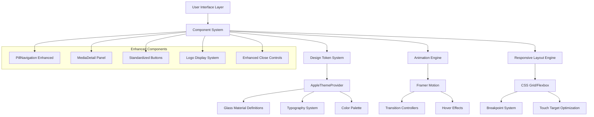

# ScreenScape 2.0 UI Redesign Technical Architecture

## 1. Architecture Design



## 2. Technology Description

- **Frontend**: React@18 + TypeScript + Framer Motion + Tailwind CSS + Vite
- **Design System**: AppleThemeProvider + Custom Glass Materials + CSS Custom Properties
- **Animation**: Framer Motion + CSS Transitions + Cubic Bezier Timing
- **Responsive**: CSS Grid + Flexbox + Container Queries + Media Queries
- **Icons**: Lucide React + Custom SVG Components
- **Image Handling**: TMDB API + Lazy Loading + Responsive Images

## 3. Component Architecture

### 3.1 Enhanced Component Structure

| Component | Current State | Enhanced State | Key Changes |
|-----------|---------------|----------------|-------------|
| PillNavigation | Basic pill styling | Full pill appearance | 50% border radius, "Live" label, enhanced glass |
| MediaDetail | Modal overlay | Integrated panel | Panel-based layout, smooth transitions |
| Button Components | Mixed styling | Standardized design | Consistent glass materials, pill shapes |
| Title Display | Text-based | Logo-first | TMDB logos, responsive scaling, fallback system |
| Close Controls | Basic styling | Enhanced design | Matching materials, proper touch targets |

### 3.2 Design Token Extensions

```typescript
// Enhanced Glass Material Definitions
interface EnhancedGlassMaterials {
  ultraThin: {
    opacity: 0.02;
    blur: 8;
    borderOpacity: 0.1;
    shadowIntensity: 0.05;
  };
  pillButton: {
    opacity: 0.06;
    blur: 16;
    borderOpacity: 0.15;
    shadowIntensity: 0.1;
    borderRadius: '50%';
  };
  enhancedProminent: {
    opacity: 0.1;
    blur: 24;
    borderOpacity: 0.2;
    shadowIntensity: 0.15;
  };
}

// Standardized Button Styling
interface ButtonTokens {
  pillShape: {
    borderRadius: '50%';
    minHeight: '44px';
    padding: '12px 16px';
  };
  iconSize: {
    standard: '20px';
    large: '24px';
  };
  transitions: {
    standard: 'all 0.2s cubic-bezier(0.4, 0, 0.2, 1)';
  };
}
```

## 4. Route Definitions

| Route | Purpose | Enhanced Features |
|-------|---------|------------------|
| / | Home page with integrated panels | Enhanced pill navigation, integrated MediaDetail panels |
| /live | Live content with pill navigation | Shortened "Live" label, consistent styling |
| /likes | User preferences with enhanced buttons | Standardized Like/Dislike button styling |
| /games | Gaming hub with consistent UI | Unified button and navigation styling |
| /settings | Settings panel integration | Enhanced close buttons, consistent materials |
| /sync | Sync options with improved UX | Standardized control styling |

## 5. Component Integration Strategy

### 5.1 PillNavigation Enhancement

```typescript
// Enhanced Navigation Item Structure
interface EnhancedNavigationItem {
  id: ViewType;
  icon: LucideIcon;
  label: string; // "Live Channels" → "Live"
  activeGradient: string;
  hoverEffects: HoverEffectConfig;
}

// Pill Styling Configuration
const pillStyling = {
  borderRadius: '50%',
  background: 'glass.pillButton',
  minWidth: 'clamp(48px, 12vw, 56px)',
  minHeight: '44px',
  padding: '8px 12px'
};
```

### 5.2 MediaDetail Panel Integration

```typescript
// Panel-Based Layout System
interface MediaDetailPanel {
  mode: 'modal' | 'integrated';
  layout: 'overlay' | 'panel';
  transitions: {
    enter: MotionProps;
    exit: MotionProps;
  };
  responsive: {
    desktop: PanelConfig;
    tablet: PanelConfig;
    mobile: PanelConfig;
  };
}
```

### 5.3 Button Standardization System

```typescript
// Unified Button Component
interface StandardizedButton {
  variant: 'pill' | 'circular' | 'rounded';
  material: 'glass' | 'solid' | 'gradient';
  size: 'small' | 'medium' | 'large';
  state: 'default' | 'active' | 'disabled';
  iconSize: number;
  touchTarget: boolean;
}
```

## 6. Logo Integration Architecture

### 6.1 TMDB Logo System

```typescript
// Logo Display Component
interface LogoDisplaySystem {
  primary: {
    source: 'tmdb-logo-endpoint';
    aspectRatio: '16:9' | '4:3' | 'auto';
    scaling: 'responsive';
  };
  fallback: {
    type: 'styled-text';
    typography: 'title-hierarchy';
    animation: 'fade-transition';
  };
  caching: {
    strategy: 'lazy-loading';
    optimization: 'webp-avif';
  };
}
```

### 6.2 Responsive Logo Scaling

```css
/* Logo Responsive System */
.logo-container {
  aspect-ratio: var(--logo-aspect-ratio, 16/9);
  width: clamp(120px, 25vw, 300px);
  height: auto;
  object-fit: contain;
}

.logo-fallback {
  font-family: var(--typography-display);
  font-weight: var(--typography-bold);
  font-size: clamp(1.5rem, 4vw, 3rem);
  background: var(--gradient-text);
  -webkit-background-clip: text;
  background-clip: text;
}
```

## 7. Animation and Transition System

### 7.1 Enhanced Motion Configuration

```typescript
// Standardized Animation Presets
const motionPresets = {
  pillHover: {
    scale: 1.05,
    transition: { duration: 0.2, ease: [0.4, 0, 0.2, 1] }
  },
  pillPress: {
    scale: 0.95,
    transition: { duration: 0.1, ease: [0.4, 0, 0.2, 1] }
  },
  panelEnter: {
    opacity: [0, 1],
    y: [20, 0],
    transition: { duration: 0.3, ease: [0.4, 0, 0.2, 1] }
  },
  glassHover: {
    backdropFilter: 'blur(20px)',
    background: 'rgba(255, 255, 255, 0.1)',
    transition: { duration: 0.2 }
  }
};
```

### 7.2 Cross-Browser Compatibility

```css
/* Enhanced Glass Effects with Fallbacks */
.glass-enhanced {
  backdrop-filter: blur(var(--blur-amount, 16px));
  -webkit-backdrop-filter: blur(var(--blur-amount, 16px));
  background: rgba(255, 255, 255, var(--glass-opacity, 0.06));
  border: 1px solid rgba(255, 255, 255, var(--border-opacity, 0.15));
  box-shadow: 
    0 8px 32px rgba(0, 0, 0, var(--shadow-intensity, 0.1)),
    inset 0 1px 0 rgba(255, 255, 255, 0.1);
}

/* Fallback for browsers without backdrop-filter */
@supports not (backdrop-filter: blur(1px)) {
  .glass-enhanced {
    background: rgba(255, 255, 255, 0.15);
    border: 1px solid rgba(255, 255, 255, 0.25);
  }
}
```

## 8. Performance Optimization

### 8.1 Component Optimization Strategy

- **Lazy Loading**: Implement for logo images and non-critical components
- **Memoization**: Use React.memo for expensive glass effect calculations
- **Animation Performance**: Utilize transform and opacity for smooth animations
- **Bundle Splitting**: Separate enhanced components for progressive loading

### 8.2 Accessibility Enhancements

```typescript
// Enhanced Accessibility Configuration
interface AccessibilityConfig {
  touchTargets: {
    minSize: '44px';
    spacing: '8px';
  };
  keyboardNavigation: {
    focusVisible: boolean;
    tabOrder: number[];
  };
  screenReader: {
    ariaLabels: Record<string, string>;
    liveRegions: string[];
  };
  reducedMotion: {
    respectPreference: boolean;
    fallbackAnimations: MotionConfig;
  };
}
```

## 9. Testing Strategy

### 9.1 Visual Regression Testing

- **Component Screenshots**: Automated visual testing for all enhanced components
- **Cross-Browser Testing**: Chrome, Safari, Firefox, Edge compatibility
- **Responsive Testing**: Multiple viewport sizes and orientations
- **Accessibility Testing**: WCAG 2.1 AA compliance verification

### 9.2 Performance Testing

- **Animation Performance**: 60fps target for all transitions
- **Glass Effect Performance**: GPU acceleration verification
- **Bundle Size Impact**: Monitor size increases from enhancements
- **Loading Performance**: Logo loading and fallback timing

## 10. Implementation Phases

### Phase 1: Foundation Enhancement
- Update AppleThemeProvider with new glass materials
- Implement standardized button components
- Enhance PillNavigation with 50% border radius

### Phase 2: Component Integration
- Convert MediaDetail to panel-based system
- Implement logo display system with TMDB integration
- Standardize all interactive elements

### Phase 3: Polish and Optimization
- Fine-tune animations and transitions
- Implement comprehensive accessibility features
- Optimize performance and cross-browser compatibility

### Phase 4: Testing and Validation
- Comprehensive visual regression testing
- Accessibility compliance verification
- Performance optimization and monitoring